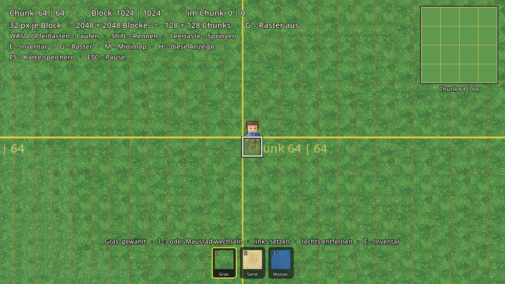
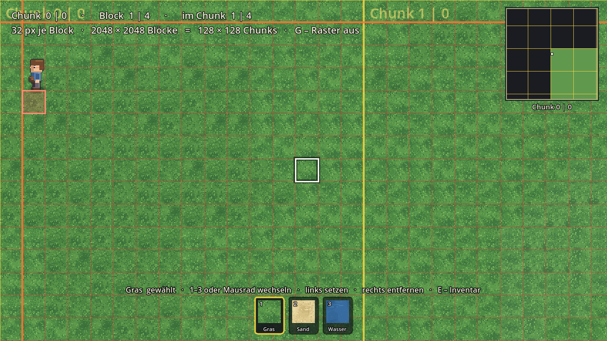
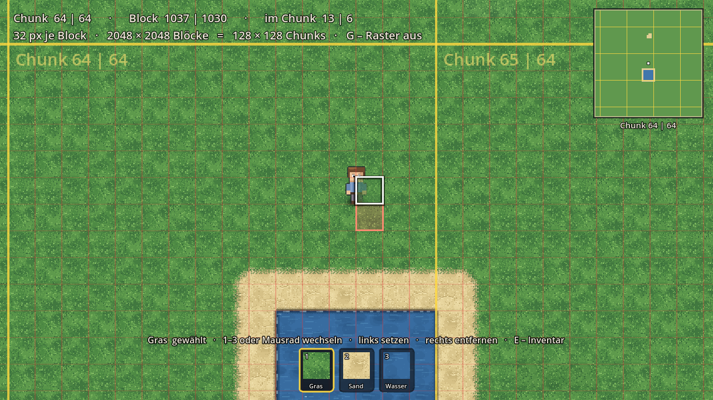
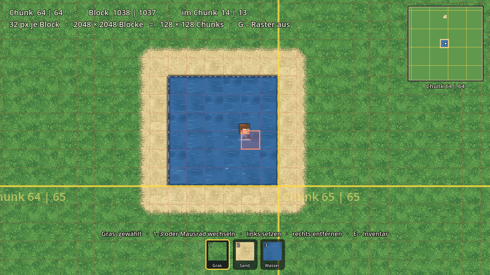
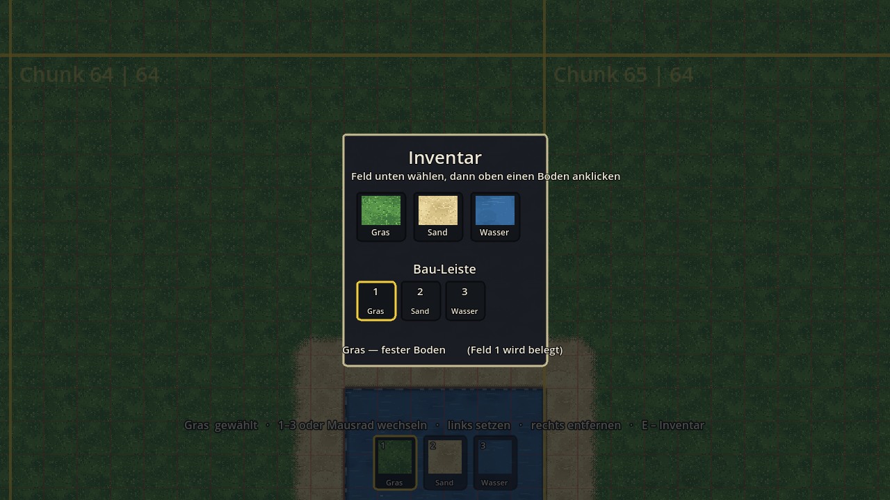
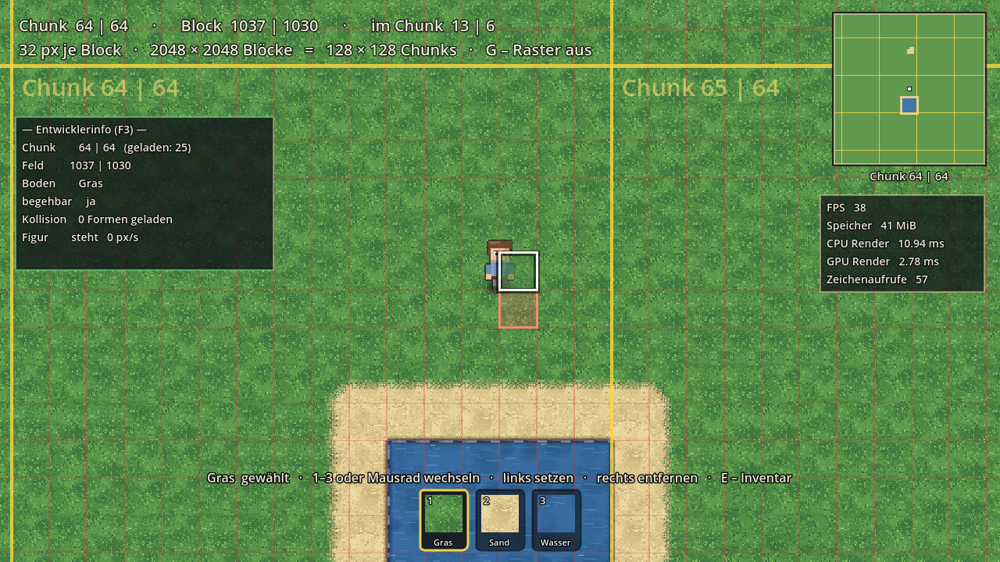
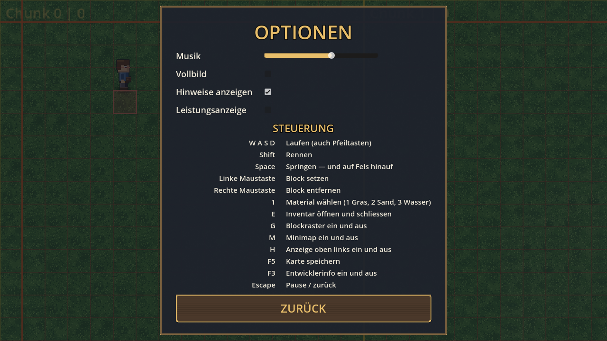
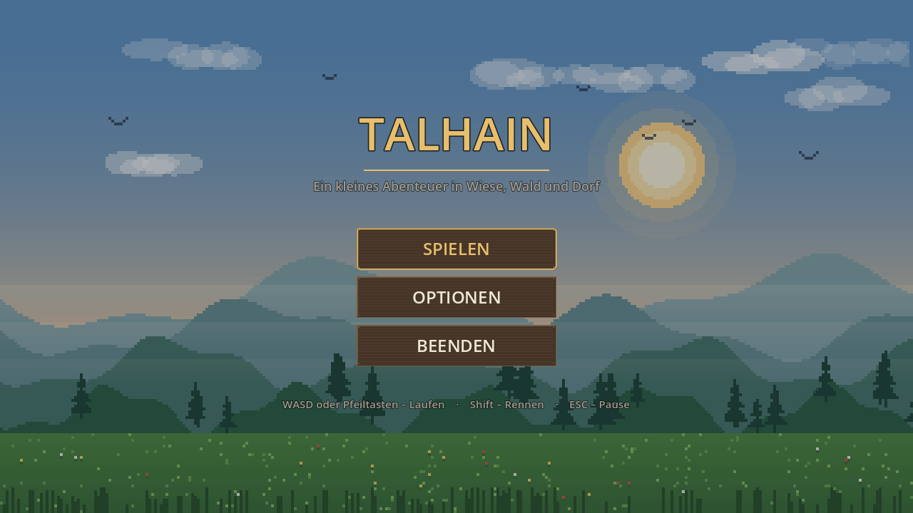

# 🌾 Talhain

Ein 2D-Top-Down-Sandkasten für Laptop und Desktop, gebaut mit **Godot 4.3**.
Du läufst als Wanderer über eine offene Karte und baust sie Block für Block
selbst — aus **Gras, Sand und Wasser**.



## So wird das Spiel gestartet

1. [Godot 4.3+](https://godotengine.org/download) herunterladen — eine einzelne
   ausführbare Datei, keine Installation nötig
2. Godot öffnen → **Importieren** → diesen Ordner wählen (die Datei `project.godot`)
3. **F5** drücken

Es startet die Szene `scenes/main.tscn`. Danach erscheint das Hauptmenü,
**SPIELEN** lädt die Welt (rund eine Viertelsekunde), und die Figur steht in der
Kartenmitte.

### Ohne Editor, direkt im Terminal

Zwei Befehle. Der erste ist **nur beim allerersten Mal** nötig — er legt den
Import-Cache an. Ohne ihn bricht Godot mit `Identifier "Config" not declared`
ab, weil die Skripte sich ohne Cache gegenseitig nicht finden.

```bash
cd <Ordner mit project.godot>
godot --headless --import      # einmalig, dauert ein paar Sekunden
godot                          # Spiel starten
```

Heißt die Godot-Datei bei dir anders (etwa `Godot_v4.3-stable_win64.exe` oder
`Godot.app`), nimm diesen Namen statt `godot`:

| System | erster Befehl (einmalig) | danach jedes Mal |
|---|---|---|
| **Windows** | `.\Godot_v4.3-stable_win64.exe --headless --import` | `.\Godot_v4.3-stable_win64.exe` |
| **macOS** | `/Applications/Godot.app/Contents/MacOS/Godot --headless --import` | `/Applications/Godot.app/Contents/MacOS/Godot` |
| **Linux** | `./Godot_v4.3-stable_linux.x86_64 --headless --import` | `./Godot_v4.3-stable_linux.x86_64` |

Beim Öffnen über die Godot-Oberfläche entfällt der Import-Befehl — das erledigt
der Editor selbst.

Alle Grafiken und die Musik entstehen beim Start im Spiel selbst — es müssen
keine Assets heruntergeladen oder importiert werden. Die Lizenzlage ist in
[`CREDITS.md`](CREDITS.md) dokumentiert.

## Drei Materialien — und sonst nichts

Es gibt genau drei Böden. Nicht neun, nicht sechs, drei:

| Material | Verhalten |
|---|---|
| **Gras** | fester Boden, Grundfüllung der ganzen Karte |
| **Sand** | fester Boden, weicher Übergang zum Gras |
| **Wasser** | wird durchschwommen: langsamer, kein Rennen, kein Springen |

Keines der drei hält auf. Die einzige unsichtbare Wand ist der Kartenrand.
Vorher gab es zusätzlich Wiese, Waldboden, Weg, Pflaster, Fels und Tiefwasser —
die sind vollständig entfernt, samt Kachelgrafik, Kollisionsdaten,
Höhenstufen-System und allen Verweisen darauf. Der Selbsttest durchsucht den
Quelltext danach und schlägt fehl, sobald noch einer auftaucht.

## Die Welt

Das Spiel startet mit einer **leeren Karte und sichtbarem Blockraster**. Das
Raster ist das technische Skelett der Welt — hier wird es absichtlich in Rot
gezeigt, damit sich planen lässt, wie viele Blöcke etwas belegt.

- **Ein Block = 32 × 32 Pixel.** Die Karte ist **2048 × 2048 Blöcke** groß —
  65 536 × 65 536 Pixel. Einmal quer durchzulaufen dauert rennend rund vier
  Minuten.
- **Ein Chunk = 16 × 16 Blöcke** (512 px), also **128 × 128 = 16 384 Chunks**.
  Die Chunk-Grenzen sind gelb und tragen ihre Nummer in der oberen linken Ecke.
- Geladen sind immer nur **5 × 5 Chunks um die Figur**; beim Laufen kommen neue
  dazu und alte fallen weg. Ohne das wäre die Karte nicht darstellbar.
- Oben links steht Chunk, Block und Position innerhalb des Chunks.
- Oben rechts eine **Minimap** mit vier Chunks Umgebung.
- **G** schaltet nur die **Rasterlinien** um. Die Bauvorschau unter dem Zeiger
  bleibt immer sichtbar — sie zeigt die gewählte Kachel halbdurchsichtig im
  Block, damit man sieht, *wohin* und *was* man setzt.



## Bauen

Unten steht eine Leiste mit drei Feldern. Jedes zeigt die echte Bodenkachel,
nicht ein Ersatzsymbol.

- **1 – 3**, **Mausrad** oder ein **Klick auf das Feld** wählt den Bodentyp.
- **Linke Maustaste** setzt ihn auf den Block unter dem Zeiger, **rechte
  Maustaste** setzt zurück auf Gras. Gedrückt halten malt.
- Der Block unter dem Zeiger ist weiß umrandet.
- Ein gesetzter Block **füllt sein Feld** und verbindet sich mit den Nachbarn —
  eine Reihe wird ein Streifen, kein Punktmuster. Das gilt in alle acht
  Richtungen, für jede Materialkombination und auch beim schnellen Ziehen.
- Die Übergänge zu den Nachbarn werden sofort mitgerechnet.
- Gebaut werden kann auch **im Laufen und im Sprung**.



Gesetztes **Wasser lässt sich durchschwimmen** — die Figur sinkt ein, wird
langsamer und bekommt einen Wellenkragen:



## Inventar

**E** öffnet das Inventar, **E** schliesst es wieder, **E** öffnet es erneut —
ein echter Umschalter. **ESC** schliesst ebenfalls.

Das Inventar ist ein eigener Spielzustand: solange es offen ist, **passiert in
der Welt nichts**. Keine Bewegung, kein Bauen, kein Abbauen, keine Bauvorschau,
keine Mausaktion. Dasselbe gilt für Pause und Optionen — ein Klick auf
„Fortsetzen“ setzt keinen Block mehr.

Oben stehen die drei Materialien, unten die drei Felder der Leiste. Erst unten
ein Feld wählen, dann oben ein Material anklicken — es wird darauf gelegt. Die
Belegung bleibt gespeichert.



## Anzeigen

Im **Optionsmenü** steht unter „Steuerung“ die vollständige Tastenbelegung —
erzeugt aus der tatsächlichen InputMap, sie kann also nicht veralten. Dort lässt
sich auch die **Leistungsanzeige** einschalten (FPS, Speicher, CPU- und
GPU-Renderzeit, Zeichenaufrufe). Sie ist bei jedem Start aus, und sie zeigt nur,
was die Engine wirklich misst — liefert sie einen Wert nicht, steht dort „—“
statt einer erfundenen Zahl.

**F3** blendet davon getrennt die Entwicklerinfo ein: Chunk, Feld, Bodentyp,
Begehbarkeit, geladene Kollisionsformen und Zustand der Figur.





## Speichern

Die gebaute Karte wird **beim Zurückgehen ins Hauptmenü und beim Beenden
automatisch gesichert**, mit **F5** auch von Hand. Sie liegt in
`user://karte.dat` (unter Linux `~/.local/share/godot/app_userdata/Talhain/`).
Ältere Stände mit neun Bodentypen werden beim Laden auf die drei heutigen
umgesetzt; passen Fassung oder Kartenmaße gar nicht, wird die Datei übergangen
statt zu stürzen.

## Steuerung

| Eingabe | Aktion |
|---|---|
| **W A S D** oder **Pfeiltasten** | Laufen |
| **Shift** | Rennen (nicht im Wasser) |
| **Leertaste** | Springen |
| **E** | Inventar öffnen / schliessen |
| **G** | Blockraster ein / aus |
| **M** | Minimap ein / aus |
| **H** | Anzeige oben links ein / aus |
| **F3** | Entwicklerinfo ein / aus |
| **1 – 3** / **Mausrad** | Material wählen |
| **Linke Maustaste** | Block setzen |
| **Rechte Maustaste** | Block zurücksetzen |
| **F5** | Karte speichern |
| **ESC** | Pause-Menü öffnen / schließen |
| **Maus** | Menüs bedienen |

## Was drin ist

**Boden** — Ein echtes Kachelraster aus vier `TileMapLayer`: Gras füllt die
Karte, darüber Sand, darüber Wasser, darüber die Kantenschicht mit Uferband und
Tiefenband. Die Schichten blenden sich per Terrain-Autotiling ineinander;
Übergangskacheln entstehen aus bilinearer Eckinterpolation mit gedithertem
Schwellwert. Das `TileSet` wird prozedural erzeugt, hat benannte Terrains mit
Eck-Bits und lässt sich im Godot-Editor mit dem Terrain-Pinsel weitermalen.

**Nahtlose Kacheln** — Jede Kachelgrafik wird mit umlaufendem Rand gezeichnet:
was rechts hinausläuft, kommt links wieder herein. Dadurch passt jede Kachel an
jede andere derselben Sorte, in jeder Nachbarschaft. Der Selbsttest misst das:
er vergleicht den Farbunterschied an der Naht mit dem im Kachelinneren. Gras
liegt bei 1,16, Sand bei 0,66, Wasser bei 0,82 — Werte um 1,0 heißen „so glatt
wie das Kachelinnere“, vorher lag Wasser bei 2,88.

**Auflösung** — 32 × 32 Pixel je Kachel bei Kamerazoom 1,5. Das Fenster
skaliert ganzzahlig (`stretch/mode = viewport`, `scale_mode = integer`), die
Kamera rundet auf gerade Weltpixel — es gibt keine halben Bildpunkte.

**Spieler** — Eigene Figur mit Idle-, Lauf- und Schwimmanimation in drei
Blickrichtungen (die vierte wird gespiegelt), Beschleunigung und Reibung.

**Kamera** — Folgt weich, bleibt innerhalb der Weltgrenzen.

**Kollision** — Nur der Kartenrand blockiert. Die Kollisionsrechtecke werden je
Chunk per Greedy-Zerlegung zusammengefasst und überlappen sich um einen halben
Pixel, damit `move_and_slide()` an einer Chunk-Grenze nicht hängenbleibt.

**UI** — Hauptmenü, Pause-Menü und Optionen (Musik, Vollbild, Hinweise,
Leistungsanzeige) mit erzeugten Pixel-Art-Rahmen. Das Titelbild hat gestaffelte
Hügel mit Dunstschleiern, ziehende Wolken und einen Vordergrund aus Halmen.
Einstellungen werden gespeichert.

**Audio** — Menü- und Weltmusik werden rechnerisch erzeugt. **Klangeffekte gibt
es bewusst keine** — kein Bau-, Schritt-, Klick- oder Sprunggeräusch. Es gibt
keine Audiodateien im Projekt.



## Projektstruktur

```
project.godot              Godot-4-Projekt (Nearest-Filter, GL Compatibility)
scenes/main.tscn           Einstiegsszene — alles Weitere entsteht im Code

src/core/config.gd         Konstanten (Kachelgröße, Tempo, Zoom) + Tastenbelegung
src/core/palette.gd        Die eine Farbpalette für alle Grafiken
src/core/settings.gd       Autoload: Einstellungen, persistent
src/core/main.gd           Zustandsautomat MENÜ / SPIEL / PAUSE / OPTIONEN / INVENTAR

src/gfx/pixel.gd           Zeichen-Werkzeuge auf Images, mit umlaufendem Kachelrand
src/gfx/tile_art.gd        Die drei Bodenkacheln in Varianten und Helligkeitsstufen
src/gfx/terrain_atlas.gd   Übergangskacheln für das Eck-Autotiling
src/gfx/edge_art.gd        Uferband auf dem Land, Tiefenband im Wasser
src/gfx/actor_art.gd       Spielerfigur (Idle, Laufzyklus, Schwimmen)

src/world/map_data.gd      Kartendaten: drei Bodentypen, Begehbarkeit, Speichern
src/world/ground_tileset.gd TileSet mit Terrains, bemalt die Schichten
src/world/world_builder.gd Karte, Kachelgrafik und Kachelsatz erzeugen
src/world/chunk_streamer.gd Lädt und entlädt Chunks um die Figur, baut die Kollision
src/world/build_tool.gd    Blöcke setzen und entfernen, Speichern
src/world/water_fx.gd      Glitzern und Uferschaum (nur im Sichtbereich)
src/world/world.gd         Setzt die Spielwelt zusammen

src/player/player.gd       Bewegung, Sprung, Schwimmen, Animation
src/camera/game_camera.gd  Weiches Folgen, Weltgrenzen, pixelgenaues Runden

src/ui/ui_theme.gd         Gemeinsames Theme
src/ui/menu_art.gd         Titelbild des Hauptmenüs
src/ui/cloud_layer.gd      Ziehende Wolken im Hauptmenü
src/ui/main_menu.gd        Startmenü
src/ui/pause_menu.gd       Pause-Menü
src/ui/options_menu.gd     Optionen samt Steuerungsübersicht aus der InputMap
src/ui/hud.gd              Chunk- und Blockanzeige, Steuerungshinweis
src/ui/build_bar.gd        Bau-Leiste mit drei Feldern
src/ui/inventory.gd        Inventar: Material auf ein Feld der Leiste legen
src/ui/minimap.gd          Übersichtskarte oben rechts
src/ui/perf_overlay.gd     Leistungsanzeige (nur gemessene Werte)
src/ui/debug_overlay.gd    Entwicklerinfo auf F3

src/audio/audio.gd         Autoload: prozedurale Musik (ohne Klangeffekte)
src/dev/self_test.gd       Automatischer Selbsttest

prototype_godsim/          Früherer God-Sim-Prototyp, unverändert archiviert
```

## Selbsttest

Das Spiel prüft sich auf Wunsch selbst — Start, Karte, Kachelsatz, Bewegung,
Bauen, Wasser, Kollision, Kamera, Eingabetrennung, Menüwechsel, Ton und
Speichern:

```bash
godot --headless --path . --import      # nur beim allerersten Mal nötig
godot --headless --path . -- --selftest
```

Der Exit-Code ist 0, wenn alles in Ordnung ist — aktuell **154 Prüfungen**.
Darunter unter anderem:

- genau drei Bodentypen in Aufzählung, Kachelstapel, Leiste, Inventar und Minimap
- kein Verweis auf einen entfernten Bodentyp mehr im Quelltext
- Kachelgröße, Atlasbereiche, Kachelursprung, Schichttransformationen,
  Z-Reihenfolge und die Umrechnung Feld → Weltkoordinate
- Bauen in alle acht Richtungen, alle neun Materialpaare nebeneinander,
  Reihen, schnelles Ziehen, 40 Setzungen am Stück, Bauen in Bewegung
- ins Wasser aus allen vier Richtungen: kein Ruck, kein Bildversatz nach oben
- E öffnet, E schliesst, E öffnet wieder
- bei Pause, Optionen und Inventar: kein Block, keine Bewegung, keine Vorschau
- Musik vorhanden, Klangeffekte weder im Ton noch an einer Aufrufstelle
- keine fremde Asset-Datei im Projekt (siehe [`CREDITS.md`](CREDITS.md))

Weltaufbau rund 260 ms bei 2048 × 2048 Blöcken. Ein Chunk ist in 1,5 ms gemalt,
die Minimap in 1,1 ms, die Physik braucht 0,5 ms je Bild.

Mit einer echten Anzeige lassen sich zusätzlich Screenshots ablegen:

```bash
godot --path . -- --selftest --shots=/tmp/shots
```

## Nächste Schritte

Die Architektur ist auf Erweiterung ausgelegt, aber bewusst schlank. Naheliegend
wären weitere Materialien (dann aber einzeln und geprüft), Figurenskins,
mehrere Speicherstände und ein Tag-/Nacht-Zyklus.

---

*Der frühere God-Sim-Prototyp „Terraria Mundi“ liegt unverändert in
`prototype_godsim/` und ist über die Git-Historie jederzeit wieder erreichbar.*
