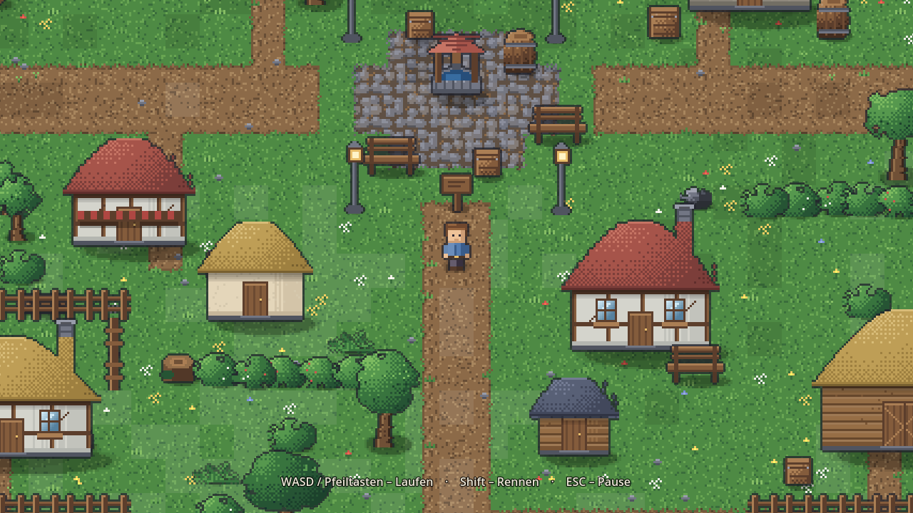
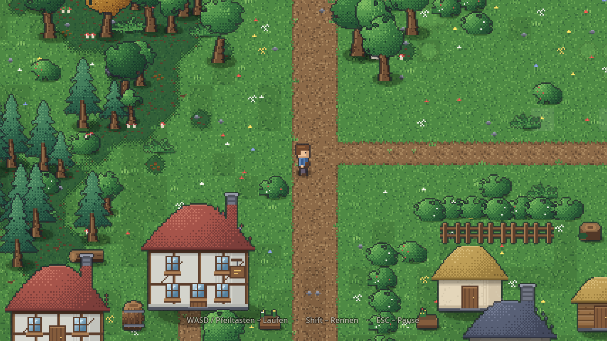
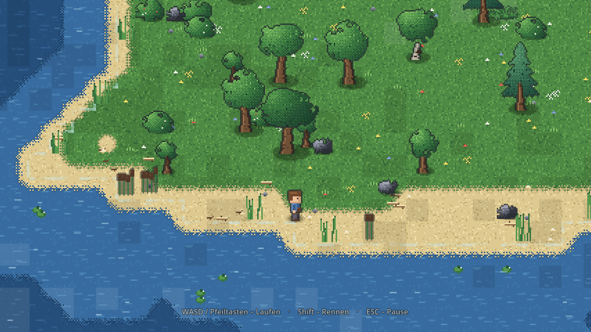

# 🌾 Talhain

Ein kleines 2D-Top-Down-Abenteuer für Laptop und Desktop, gebaut mit **Godot 4.3**.
Du läufst als Wanderer durch eine überschaubare Insel: Dorf, Wiese, Wald, Felsen und eine Bucht mit Strand.


## So wird das Spiel gestartet

1. [Godot 4.3+](https://godotengine.org/download) herunterladen — eine einzelne
   ausführbare Datei, keine Installation nötig
2. Godot öffnen → **Importieren** → diesen Ordner wählen (die Datei `project.godot`)
3. **F5** drücken

Es startet die Szene `scenes/main.tscn`. Danach erscheint das Hauptmenü,
**SPIELEN** lädt die Welt (rund 1,5 Sekunden), und die Figur steht am Dorfplatz.

### Ohne Editor, direkt im Terminal

Zwei Befehle. Der erste ist **nur beim allerersten Mal** nötig — er legt den
Import-Cache an. Ohne ihn bricht Godot mit `Identifier "Config" not declared`
ab, weil die Skripte sich ohne Cache gegenseitig nicht finden.

```bash
cd <Ordner mit project.godot>
godot --headless --import      # einmalig, dauert ein paar Sekunden
godot                          # Spiel starten
```

Heißt die Godot-Datei bei dir anders (etwa `Godot_v4.3-stable_win64.exe` oder
`Godot.app`), nimm diesen Namen statt `godot`:

| System | erster Befehl (einmalig) | danach jedes Mal |
|---|---|---|
| **Windows** | `.\Godot_v4.3-stable_win64.exe --headless --import` | `.\Godot_v4.3-stable_win64.exe` |
| **macOS** | `/Applications/Godot.app/Contents/MacOS/Godot --headless --import` | `/Applications/Godot.app/Contents/MacOS/Godot` |
| **Linux** | `./Godot_v4.3-stable_linux.x86_64 --headless --import` | `./Godot_v4.3-stable_linux.x86_64` |

Beim Öffnen über die Godot-Oberfläche entfällt der Import-Befehl — das erledigt
der Editor selbst.

Alle Grafiken und Klänge entstehen beim Start im Spiel selbst — es müssen
keine Assets heruntergeladen oder importiert werden. Die Lizenzlage ist in
[`CREDITS.md`](CREDITS.md) dokumentiert.

## Steuerung

| Eingabe | Aktion |
|---|---|
| **W A S D** oder **Pfeiltasten** | Laufen |
| **Shift** | Rennen |
| **ESC** | Pause-Menü öffnen / schließen |
| **Maus** | Menüs bedienen |

## Was drin ist

**Welt** — Eine Insel aus 96 × 72 Kacheln mit klar erkennbaren Gebieten: ein Dorf mit
gepflastertem Platz, Brunnen und elf Gebäuden, dichter Misch­wald im Nordwesten, blühende Wiese im
Nordosten, Felsland im Osten und eine Bucht mit Sandstrand im Südwesten. Getretene Erdwege
verbinden alles miteinander.

**Dorf** — Acht Gebäudetypen (Gasthaus, Schmiede, Werkstatt, Bauernhaus, Scheune, Wohnhäuser,
Schuppen) in insgesamt 17 Varianten: Fachwerk, Putz, Bretterwand oder Bruchstein, dazu Ziegel-,
Schiefer- oder Reetdächer, Schornsteine, Markisen, Wirtshausschild. Dazwischen Brunnen, Bänke,
Laternen, Holzstapel, Blumenkästen, Fässer, Kisten, Zäune und Vorgärten.

**Wald** — Neun Baumarten in 26 Varianten (Eiche, dunkle Eiche, Herbsteiche, Birke, alter Baum,
Jungbaum, große und kleine Fichte) plus Büsche, Farne, Baumstümpfe und Totholz. Die Verteilung
folgt Dichtefeldern statt gleichmäßigem Würfeln: es gibt Gruppen, dichte Bestände, Lichtungen und
ausgedünnte Waldränder.

**Auflösung** — 32 × 32 Pixel je Kachel bei Kamerazoom 1,5. Gegenüber der
ersten Fassung (16 px bei Zoom 3) ist das Sichtfeld unverändert, jede Kachel
hat aber die vierfache Pixelfläche. Alle Grafiken wurden dafür neu gezeichnet,
nicht hochskaliert.

**Boden** — Ein echtes Kachelraster aus neun `TileMapLayer`. Gras füllt die Karte, darüber liegen
Wiese, Waldboden, Fels, Sand, Wasser, Tiefwasser, Weg und Pflaster. Die Schichten blenden sich per
Terrain-Autotiling ineinander: Übergangskacheln entstehen aus bilinearer Eckinterpolation mit
gedithertem Schwellwert, gebaute Flächen wie Weg und Pflaster bekommen stattdessen eckige
Quadranten. Das `TileSet` wird prozedural erzeugt, hat benannte Terrains mit Eck-Bits und lässt
sich im Godot-Editor mit dem Terrain-Pinsel weitermalen. Im Spiel ist vom Raster nichts zu sehen.

**Wege** — Achsparallel gebaut: zwischen zwei Wegpunkten erst die längere, dann die kürzere Achse.
Daraus entstehen gerade Strecken, rechte Winkel und echte T-Kreuzungen. Zwei Hauptachsen kreuzen
sich auf dem Dorfplatz, davon zweigen Ausfallstraßen und Stichwege zu den Höfen ab.

**Grafik** — Alle Texturen entstehen zur Laufzeit aus **einer** Farbpalette. Jede Fläche wird über
eine Farbrampe schattiert, deren Licht bei allen Objekten aus derselben Richtung kommt (oben
links); zwischen den Stufen wird gedithert. Bodenkacheln gibt es in vier Varianten mal drei
großflächigen Helligkeitsstufen, dazu Streudekoration, Hecken als Grundstücksgrenzen und
eingebackene Schatten. Das Wasser glitzert, der Uferschaum bewegt sich.

**Spieler** — Eigene Figur mit Idle- und Laufanimation in drei Blickrichtungen (die vierte wird
gespiegelt), Beschleunigung und Reibung, Schrittgeräusche.


**Kamera** — Folgt weich, bleibt innerhalb der Weltgrenzen.

**Kollision** — Bäume, Felsen, Häuser, Zäune und Wasser blockieren; Wege, Wiesen und Strand sind
begehbar. Jedes Objekt kollidiert nur mit seinem Fußabdruck am Boden, nicht mit der ganzen
Bildfläche — man läuft also hinter einer Baumkrone und einem Hausdach vorbei, aber nicht durch
Stamm oder Wand. Die Wasserflächen werden per Greedy-Zerlegung zu wenigen grossen Rechtecken
zusammengefasst.

**UI** — Hauptmenü, Pause-Menü und Optionen (Musik, Effekte, Vollbild, Hinweise) mit erzeugten
Pixel-Art-Rahmen: Holzknöpfe mit Fase und Nieten, gerahmte Tafeln. Das Titelbild hat gestaffelte
Hügel mit Dunstschleiern, ziehende Wolken und einen Vordergrund aus Halmen. Einstellungen werden
gespeichert.

**Audio** — Menü- und Weltmusik sowie alle Effekte werden rechnerisch erzeugt. Es gibt keine
Audiodateien im Projekt.


## Projektstruktur

```
project.godot              Godot-4-Projekt (Nearest-Filter, GL Compatibility)
scenes/main.tscn           Einstiegsszene — alles Weitere entsteht im Code

src/core/config.gd         Konstanten (Kachelgröße, Tempo, Zoom) + Tastenbelegung
src/core/palette.gd        Die eine Farbpalette für alle Grafiken
src/core/settings.gd       Autoload: Einstellungen, persistent
src/core/main.gd           Zustandsautomat MENÜ / SPIEL / PAUSE / OPTIONEN

src/gfx/pixel.gd           Zeichen-Werkzeuge auf Images (Rechteck, Ellipse, Outline, Farbrampe)
src/gfx/tile_art.gd        Bodenkacheln, Helligkeitsstufen, Streudekoration
src/gfx/terrain_atlas.gd   Übergangskacheln für das Eck-Autotiling
src/gfx/prop_art.gd        Bäume, Felsen, Gebäude, Dorfinventar — alles mit Varianten
src/gfx/actor_art.gd       Spielerfigur (Idle + Laufzyklus, 3 Richtungen)

src/world/layout.gd        Von Hand gesetzte Weltstruktur (Dorf, Wege, Zäune, Hecken)
src/world/map_data.gd      Kartendaten: Bodentypen, Inselform, Wegenetz, Begehbarkeit
src/world/ground_tileset.gd TileSet mit Terrains und Dekorationskacheln, bemalt die Schichten
src/world/world_builder.gd Boden backen, Requisiten verteilen, Kollision bauen
src/world/water_fx.gd      Glitzern und Uferschaum (nur im Sichtbereich)
src/world/world.gd         Setzt die Spielwelt zusammen

src/player/player.gd       Bewegung und Animation
src/camera/game_camera.gd  Weiches Folgen, Weltgrenzen

src/ui/ui_theme.gd         Gemeinsames Theme
src/ui/menu_art.gd         Titelbild des Hauptmenüs
src/ui/main_menu.gd        Startmenü
src/ui/pause_menu.gd       Pause-Menü
src/ui/options_menu.gd     Optionen
src/ui/hud.gd              Steuerungshinweis beim Start
src/ui/cloud_layer.gd      Ziehende Wolken im Hauptmenü

src/audio/audio.gd         Autoload: prozedurale Musik und Effekte
src/dev/self_test.gd       Automatischer Selbsttest
src/dev/asset_sheet.gd     Kontaktbogen aller Grafiken zur Sichtprüfung

prototype_godsim/          Früherer God-Sim-Prototyp, unverändert archiviert
```

## Selbsttest

Das Spiel prüft sich auf Wunsch selbst — Start, Karte, Bewegung, Kollision, Kamera,
Weltgrenzen, Audio und alle Menüwechsel:

```bash
godot --headless --path . --import      # nur beim allerersten Mal nötig
godot --headless --path . -- --selftest
```

Der Exit-Code ist 0, wenn alles in Ordnung ist (aktuell 36 Prüfungen; Weltaufbau ~1,5 s,
616 Objekte, 572 Kollisionsformen, 45 Zeichenaufrufe). Eine der Prüfungen durchsucht das
Projekt nach fremden Asset-Dateien und schlägt fehl, sobald eine auftaucht — siehe
[`CREDITS.md`](CREDITS.md). Mit einer echten Anzeige
lassen sich zusätzlich Screenshots und ein Kontaktbogen aller erzeugten Grafiken ablegen:

```bash
godot --path . -- --selftest --shots=/tmp/shots
```


## Vorher / Nachher

Links das 16-px-Raster der ersten Fassung, rechts das heutige 32-px-Raster.

| vorher | nachher |
|---|---|
|  |  |
|  |  |
|  |  |

## Nächste Schritte

Die Architektur ist auf Erweiterung ausgelegt, aber bewusst noch schlank. Naheliegend wären
NPCs mit Dialogen, ein Speicherstand, Innenräume der Häuser, ein Tag-/Nacht-Zyklus und
mehr Gebiete. Erst danach lohnen sich größere Systeme.

---

*Der frühere God-Sim-Prototyp „Terraria Mundi" liegt unverändert in `prototype_godsim/`
und ist über die Git-Historie jederzeit wieder erreichbar.*
