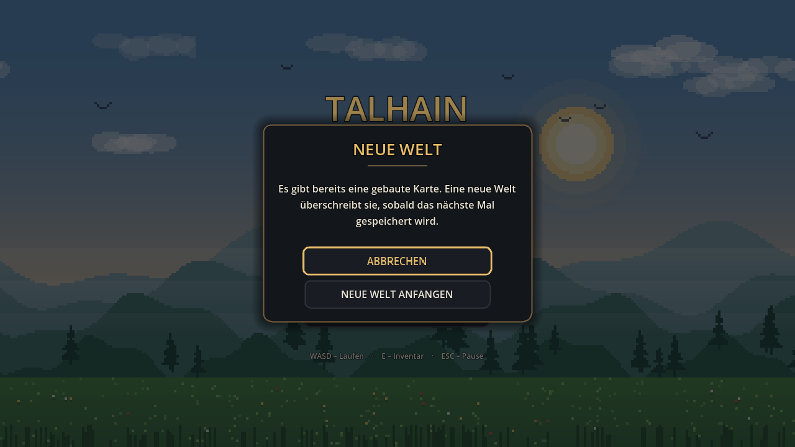
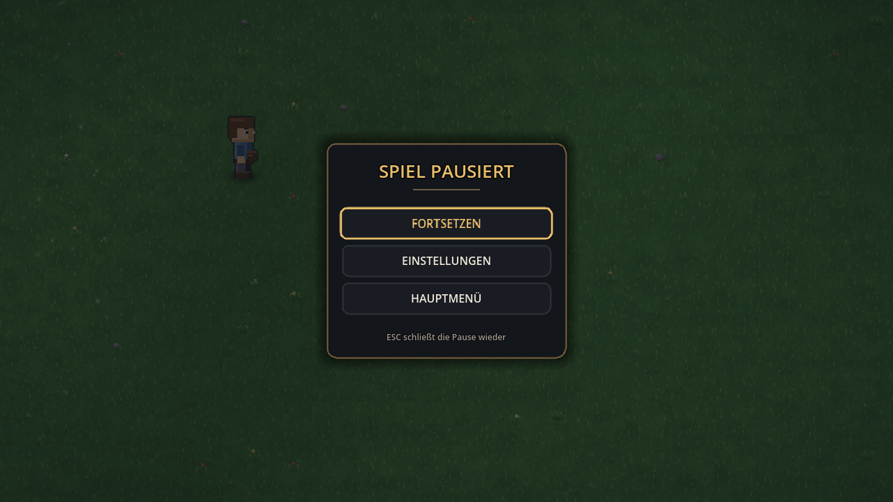
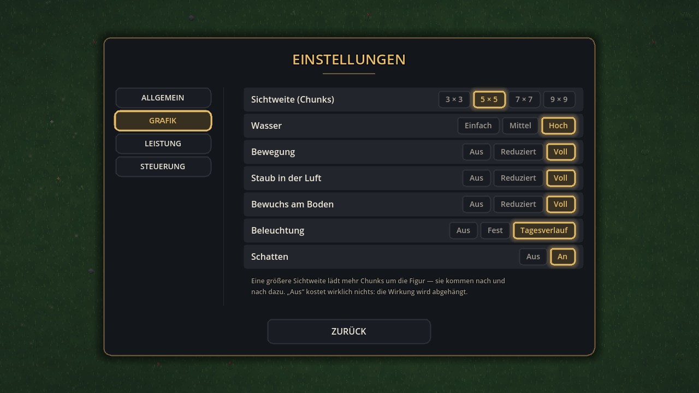
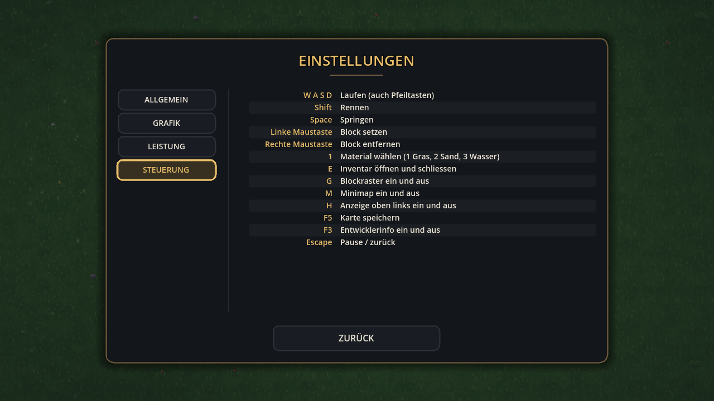
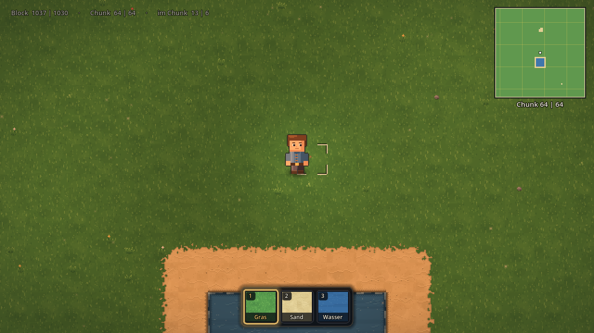
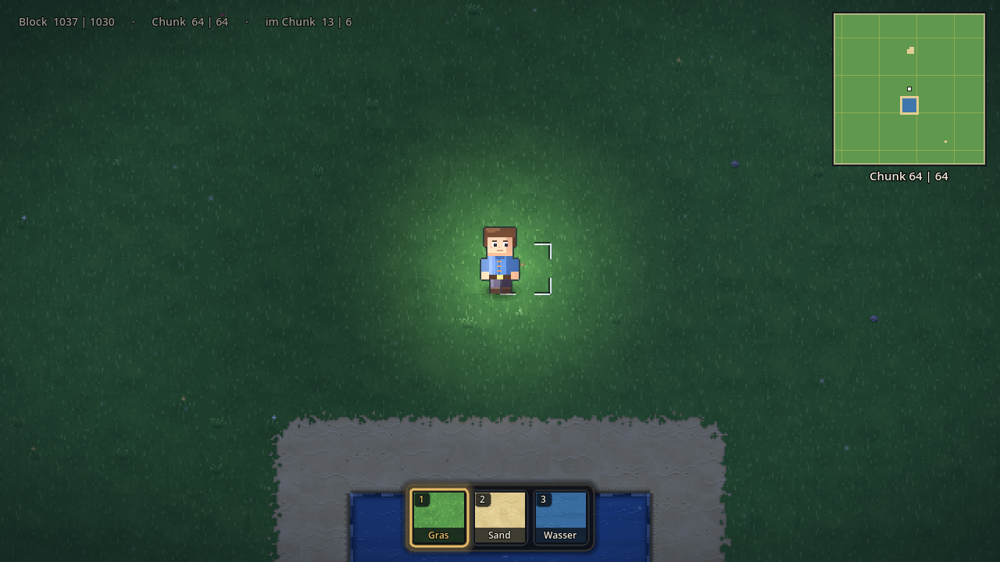

# 🌾 Talhain

Ein 2D-Top-Down-Sandkasten für Laptop und Desktop, gebaut mit **Godot 4.3**.
Du läufst als Wanderer über eine offene Karte und baust sie Block für Block
selbst — aus **Gras, Sand und Wasser**.


## So wird das Spiel gestartet

1. [Godot 4.3+](https://godotengine.org/download) herunterladen — eine einzelne
   ausführbare Datei, keine Installation nötig
2. Godot öffnen → **Importieren** → diesen Ordner wählen (die Datei `project.godot`)
3. **F5** drücken

Es startet die Szene `scenes/main.tscn`. Danach erscheint das Hauptmenü,
**SPIELEN** lädt die Welt (rund eine Viertelsekunde), und die Figur steht in der
Kartenmitte.

### Ohne Editor, direkt im Terminal

Zwei Befehle. Der erste ist **nur beim allerersten Mal** nötig — er legt den
Import-Cache an. Ohne ihn bricht Godot mit `Identifier "Config" not declared`
ab, weil die Skripte sich ohne Cache gegenseitig nicht finden.

```bash
cd <Ordner mit project.godot>
godot --headless --import      # einmalig, dauert ein paar Sekunden
godot                          # Spiel starten
```

Heißt die Godot-Datei bei dir anders (etwa `Godot_v4.3-stable_win64.exe` oder
`Godot.app`), nimm diesen Namen statt `godot`:

| System | erster Befehl (einmalig) | danach jedes Mal |
|---|---|---|
| **Windows** | `.\Godot_v4.3-stable_win64.exe --headless --import` | `.\Godot_v4.3-stable_win64.exe` |
| **macOS** | `/Applications/Godot.app/Contents/MacOS/Godot --headless --import` | `/Applications/Godot.app/Contents/MacOS/Godot` |
| **Linux** | `./Godot_v4.3-stable_linux.x86_64 --headless --import` | `./Godot_v4.3-stable_linux.x86_64` |

Beim Öffnen über die Godot-Oberfläche entfällt der Import-Befehl — das erledigt
der Editor selbst.

Alle Grafiken und die Musik entstehen beim Start im Spiel selbst — es müssen
keine Assets heruntergeladen oder importiert werden. Die Lizenzlage ist in
[`CREDITS.md`](CREDITS.md) dokumentiert.

## Drei Materialien — und sonst nichts

Es gibt genau drei Böden. Nicht neun, nicht sechs, drei:

| Material | Verhalten |
|---|---|
| **Gras** | fester Boden, Grundfüllung der ganzen Karte |
| **Sand** | fester Boden, weicher Übergang zum Gras |
| **Wasser** | wird durchschwommen: langsamer, kein Rennen, kein Springen |

Keines der drei hält auf. Die einzige unsichtbare Wand ist der Kartenrand.
Vorher gab es zusätzlich Wiese, Waldboden, Weg, Pflaster, Fels und Tiefwasser —
die sind vollständig entfernt, samt Kachelgrafik, Kollisionsdaten,
Höhenstufen-System und allen Verweisen darauf. Der Selbsttest durchsucht den
Quelltext danach und schlägt fehl, sobald noch einer auftaucht.

## Die Welt

Das Spiel startet mit einer **leeren Karte** — und ohne Raster. Das Raster ist
das technische Skelett der Welt und hilft beim Planen, aber es ist ein
Werkzeug, kein Teil der Welt: eingeschaltet legt es ein gelbes Kreuz über den
ganzen Bildschirm und schreibt „Chunk 64 | 64" quer neben die Figur. Wer das
Spiel zum ersten Mal startete, sah genau das — eine Karte mit Gitternetz, keinen
Ort. **G** schaltet es an, die Steuerungshilfe sagt das in der ersten Zeile, und
die Minimap zeigt Gebautes auch ohne Raster.

Eingeschaltet ist es bewusst zurückhaltend. Vorher waren die Blocklinien
kräftig rot und die Chunk-Linien kräftig gelb; über den ganzen Bildschirm
gelegt sah die Welt damit aus wie Millimeterpapier. Zum Planen reicht eine
Linie, die man sieht, wenn man sie sucht.

- **Ein Block = 32 × 32 Pixel.** Die Karte ist **2048 × 2048 Blöcke** groß —
  65 536 × 65 536 Pixel. Einmal quer durchzulaufen dauert rennend rund vier
  Minuten.
- **Ein Chunk = 16 × 16 Blöcke** (512 px), also **128 × 128 = 16 384 Chunks**.
  Die Chunk-Grenzen sind gelb und tragen ihre Nummer in der oberen linken Ecke.
- Geladen sind immer nur **5 × 5 Chunks um die Figur**; beim Laufen kommen neue
  dazu und alte fallen weg. Ohne das wäre die Karte nicht darstellbar.
- Oben links steht Chunk, Block und Position innerhalb des Chunks.
- Oben rechts eine **Minimap** mit vier Chunks Umgebung.
- **G** schaltet nur die **Rasterlinien** um. Die Bauvorschau unter dem Zeiger
  bleibt immer sichtbar — sie zeigt die gewählte Kachel halbdurchsichtig im
  Block, damit man sieht, *wohin* und *was* man setzt.
- **Bodenmarken liegen unter der Figur.** Bauvorschau und das markierte Feld
  werden auf einer eigenen Ebene unter der Spielfigur gezeichnet, Rasterlinien
  und Chunk-Nummern darüber. Vorher lag alles zusammen ganz oben — und weil das
  Zielfeld fast immer an die Figur grenzt, lag ein halbdurchsichtiger Schleier
  über ihrer unteren Hälfte und die weißen Eckwinkel liefen quer durchs
  Gesicht. Die Figur sah durchsichtig aus. Eine Markierung auf dem Boden gehört
  auf den Boden: sie darf von dem verdeckt werden, was darauf steht.


## Bauen

Unten steht die Bauleiste: drei Felder in einer zusammenhängenden Leiste, jedes
mit Nummer, Materialbild und Namen. Das Bild ist kein Ersatzsymbol, sondern ein
Stück echter Boden — vier der Kacheln, die auch auf der Karte liegen, in
ganzzahliger Vergrößerung und deshalb ohne Verzerrung. Das gewählte Feld hat
einen kräftigen Rahmen in der Akzentfarbe und einen weichen Schein, es ist also
auch aus dem Augenwinkel zu erkennen.

- **1 – 3**, **Mausrad** oder ein **Klick auf das Feld** wählt den Bodentyp.
- **Linke Maustaste** setzt ihn auf den Block unter dem Zeiger, **rechte
  Maustaste** setzt zurück auf Gras. Gedrückt halten malt.
- Der Block unter dem Zeiger wird von **vier Eckwinkeln** eingefasst, mit der
  gewählten Kachel halbdurchsichtig darin. Winkel statt eines geschlossenen
  Kastens: ein Kasten legt sich wie ein zweites Raster über die Welt und
  schluckt die Kachel darunter.
- Jeder gesetzte Block bekommt für zwei Zehntelsekunden einen **Rahmen, der
  herauswächst und verblasst** — ohne so ein Zeichen fühlt sich Bauen an, als
  füllte man eine Tabelle aus. Beim schnellen Ziehen bleiben höchstens 24
  Zeichen stehen, sonst verdecken sie die Welt, die sie zeigen sollen.
- Beim Aufkommen nach einem Sprung staubt es kurz unter der Figur.
- Ein gesetzter Block **füllt sein Feld** und verbindet sich mit den Nachbarn —
  eine Reihe wird ein Streifen, kein Punktmuster. Das gilt in alle acht
  Richtungen, für jede Materialkombination und auch beim schnellen Ziehen.
- Die Übergänge zu den Nachbarn werden sofort mitgerechnet.

### Das Gelände erkennt die Form

Die Übergangskachel eines Feldes ist durch ihre **Eckmaske** bestimmt: vier
Bits, eines je Ecke, gesetzt wenn eines der drei dort anliegenden Felder zur
Schicht gehört. Daraus ergibt sich von selbst, welche Darstellung passt:

| Was gebaut wurde | Was das Feld daneben bekommt |
|---|---|
| einzelnes Feld | Vollkachel; ringsum Kanten und Aussenecken |
| gerade Fläche | Vollkachel innen, gerade Kante aussen (2 Bits) |
| Aussenecke | nur diagonal berührt → 1 Bit |
| Innenecke (L-Form) | drei Ecken bedeckt → 3 Bits |
| Übergang zu Wasser | hart am Block, kein Saum — sonst läge die Brandung auf dem Sand |

Der Selbsttest baut jede dieser Formen und prüft die Maske, statt Bilder zu
vergleichen: „Feld schräg über einem Einzelblock ist eine Aussenecke",
„Das Feld in der Kerbe einer L-Form ist eine Innenecke". Ein Ausrutscher im
Autotiling fällt damit sofort auf.
- Gebaut werden kann auch **im Laufen und im Sprung**.


Gesetztes **Wasser lässt sich durchschwimmen** — die Figur sinkt ein, wird
langsamer und bekommt einen Wellenkragen. Unter der Wasserlinie wird sie nicht
abgeschnitten, sondern **eingetaucht**: durchscheinend und zur Wasserfarbe hin
verschoben, nach unten hin immer weniger. Vorher wurde alles darunter gelöscht,
und das sah aus, als steckte sie in einem gestanzten Loch. Der Wellenkragen ist
ein **Ring** statt dreier waagerechter Reihen — er läuft vorn über den Körper
und verschwindet hinten dahinter, und daran erkennt man, dass die Figur *im*
Wasser ist und nicht davor:


## Inventar

**E** öffnet das Inventar, **E** schliesst es wieder, **E** öffnet es erneut —
ein echter Umschalter. **ESC** schliesst ebenfalls.

Das Inventar ist ein eigener Spielzustand: solange es offen ist, **passiert in
der Welt nichts**. Keine Bewegung, kein Bauen, kein Abbauen, keine Bauvorschau,
keine Mausaktion. Ein Klick auf ein Feld im Inventar setzt niemals gleichzeitig
einen Block. Dasselbe gilt für Pause und Optionen — ein Klick auf „Fortsetzen“
setzt keinen Block mehr.

Oben stehen die drei Materialien, unten die Bauleiste — dieselbe Leiste, die im
Spiel unten am Bildrand steht, mit denselben Feldern. Ein Klick auf ein Feld
wählt es, ein Klick auf ein Material legt es darauf. Die Belegung bleibt
gespeichert.

Erklärt wird das nicht mehr mit einem Satz, sondern mit der Anzeige selbst: das
gewählte Feld **und** das Material, das darauf liegt, sind gleichzeitig
hervorgehoben. Jedes Feld hat vier klar unterscheidbare Zustände — ruhig, beim
Überfahren aufgehellt, gewählt mit Rahmen und Schein, und abgeblendet. Die
Übergänge dazwischen sind kurz und ruhig.

Inventar und Bauleiste bleiben getrennte Ansichten mit getrennten Aufgaben: das
Inventar bestückt, die Leiste wählt im Spiel schnell aus. Sie teilen sich genau
einen Zustand — das gewählte Feld — und werden nie gleichzeitig angezeigt.

Im Bild unten sieht man alle drei Zustände auf einmal: **Gras** gewählt,
**Sand** überfahren, **Wasser** ruhig.


## Menüs

Alle Oberflächen — Hauptmenü, Pause, Einstellungen, Rückfragen, Inventar und
Bauleiste — sind aus denselben Bausteinen gebaut: dieselben Abstände, dieselben
Radien, dieselbe Schriftstaffel, dieselben Farben, dieselbe Einblendung. Die
Werte stehen an genau einer Stelle (`src/ui/ui_theme.gd`); kein Menü erfindet
eigene. Der Selbsttest prüft, dass wirklich jede Oberfläche dasselbe Theme
benutzt — das ging vorher still schief, weil Godot ein Theme nicht über eine
`CanvasLayer` hinweg vererbt.

Jede Schaltfläche hat vier unterscheidbare Zustände (ruhig, überfahren,
gedrückt, Fokus) und wächst beim Überfahren einen Hauch, statt hart die Farbe
zu wechseln. Tastatur und Maus sehen dabei gleich aus: wer mit den Pfeiltasten
durch ein Menü geht, sieht dasselbe wie mit dem Zeiger.

**Hauptmenü** — **Fortsetzen** steht nur da, wenn es eine gebaute Karte gibt.


**Neue Welt** fragt vorher nach, wenn dabei eine gebaute Karte verloren ginge.
Die Datei wird dabei nicht gelöscht — sie wird erst beim nächsten Speichern
überschrieben:



**Pause** — ESC hält das Spiel an. Solange ein Menü offen ist, passiert in der
Welt nichts: keine Bewegung, kein Bauen, keine Mausaktion. Ein Menü bleibt
undurchlässig, bis es ganz ausgeblendet ist — der Klick auf „Fortsetzen" kann
deshalb keinen Block setzen.



## Einstellungen

Vier Kategorien statt einer langen Liste: **Allgemein**, **Grafik**,
**Leistung**, **Steuerung**. Jede Zeile ist ein Streifen über die ganze
Seitenbreite — Beschriftung links, Stufen rechts. Auch Schalter sind Stufen
(„Aus / An"), damit nicht Kästchen neben Auswahlfeldern stehen.

Vier, nicht fünf: „Ton" bestand aus einem einzigen Regler und war eine fast
leere Seite. Ein Thema, das aus einer Zeile besteht, ist kein Thema, sondern
eine Zeile — die Musik steht jetzt bei „Allgemein", mit ihrem Wert in Prozent
daneben.


Unter **Grafik** stehen die sieben Stufen, die wirklich etwas am Bild ändern:



Unter **Steuerung** steht die vollständige Tastenbelegung als Tabelle über die
volle Seitenbreite:



Es steht dort **nichts, was nicht wirkt**:

| Einstellung | Was sie tatsächlich tut |
|---|---|
| **Sichtweite** 3×3 … 9×9 | setzt den Chunk-Radius; mehr Chunks werden geladen und kommen über die nächsten Bilder dazu, zu weite fliegen sofort raus |
| **Wasser** Einfach / Mittel / Hoch | Bildrate der Wasserwirkung (8 / 16 / 24 Hz); „Einfach“ zeichnet Glitzern und Brandung gar nicht mehr |
| **Bewegung** Aus / Reduziert / Voll | Wind über dem Gras und Licht auf dem Wasser; „Aus“ hängt die Materialien ab, statt sie auf null zu rechnen |
| **Staub in der Luft** Aus / Reduziert / Voll | 0 / 18 / 42 schwebende Punkte im sichtbaren Ausschnitt |
| **Bewuchs am Boden** Aus / Reduziert / Voll | Dichte der Streu-Dekoration (Gras 0 / 70 / 150 ‰, Sand 0 / 25 / 55 ‰); „Aus“ lädt die Schicht gar nicht erst |
| **Beleuchtung** Aus / Fest / Tagesverlauf | Tageslicht, Schein um die Figur und Vignette; „Aus“ hängt alle drei ab und stellt den Prozessschritt ein |
| **Schatten** Aus / An | der Bodenschatten der Figur |
| **Bildratengrenze** 30 … Unbegrenzt | `Engine.max_fps` |
| **Bildsynchronisierung** | VSync des Fensters |
| **Vollbild**, **Hinweise**, **Leistungsanzeige**, **Musik** | wie gehabt |

Eine **Mindest-Bildrate** gibt es bewusst nicht: die kann kein Spiel zusichern.
Was eingestellt wird, ist eine Obergrenze — sie hält die Bildabstände
gleichmäßig, statt so viele Bilder wie möglich zu erzeugen.

Alles wird sofort wirksam und sofort in `user://settings.cfg` gesichert. Der
Selbsttest prüft für jede Einstellung, dass sich das System dahinter ändert,
und dass sie einen Neustart übersteht.

Unter **Steuerung** steht die vollständige Tastenbelegung — erzeugt aus der
tatsächlichen InputMap, sie kann also nicht veralten.

## Die Welt bewegt sich

Über dem Gras laufen **Windböen**, über dem Wasser wandern **Lichtstreifen**,
und in der Luft schweben **Staub und Pollen**. Zusammen ist das der Unterschied
zwischen einem Bild und „draußen“ — ohne sie steht die Luft über dem Boden
völlig still.

Wind und Wasserlicht laufen als Shader auf der jeweiligen Bodenschicht. Das ist
hier die einzige vertretbare Bauform: der Boden sind vier `TileMapLayer` mit
Millionen möglicher Kacheln, ein Knoten je bewegtem Halm wäre nicht bezahlbar.
So kostet die Bewegung genau drei Materialien — unabhängig davon, wie groß die
Welt ist.

Zwei Entscheidungen stecken darin:

- **Gerechnet wird je Eckpunkt, nicht je Bildpunkt.** Eine Kachel hat vier Ecken
  und 1024 Bildpunkte. Die erste Fassung rechnete die Wellen im Fragment und
  kostete 66 ms je Bild statt 14 — dieselbe Wirkung im Vertex-Schritt kostet
  wieder rund 14. Die Wellenlänge liegt bei mehreren hundert Bildpunkten, die
  Interpolation über eine 32er-Kachel sieht man nicht.
- **Verändert wird die Helligkeit, nicht die Lage der Bildpunkte.** Die Kacheln
  kommen aus einem Atlas; ein verschobenes UV griffe in die Nachbarkachel im
  Atlasbild, und an jeder Kachelkante entstünden Streifen fremder Farbe.

Der Staub lebt ausschließlich im sichtbaren Ausschnitt: wer ihn verlässt, wird
auf der Gegenseite wieder eingesetzt statt weiterberechnet. Dadurch kostet die
Wirkung immer gleich viel, egal wie groß die Welt ist.

Der Selbsttest misst alle vier Kombinationen (mit/ohne Wind, mit/ohne Staub) und
schlägt fehl, wenn die Bewegung das Bild um eine Größenordnung teurer macht.

### Der Boden sieht aus wie Boden

Die Gras- und Sandkacheln sind neu gezeichnet. Vorher lagen **230 deckende
Einzelpixel auf 1024** — knapp ein Viertel der Kachel. Aus zwei Metern Abstand
war das kein Gras, sondern Bildrauschen, und es überdeckte jede größere
Struktur. Jetzt sind es rund 70, und sie werden eingeblendet statt gesetzt.
Die Halme stehen in kleinen Büscheln statt gleichmäßig verstreut — zwei bis
drei nebeneinander liest man als Gras, einzelne Striche nicht.

Damit fielen auch die Helligkeitsstufen je Kachel auf, die das dichte Korn
vorher verdeckt hatte: sie sind von 3,5 % auf 1,8 % zurückgenommen. Die große
Helligkeitsbewegung kommt jetzt ohnehin vom Wind, und die läuft über
Kachelkanten hinweg weich durch.

### Die Welt hat Dinge

Auf Gras und Sand liegt **Streu-Dekoration**: Grasbüschel, rote, gelbe und
weiße Blumen, Klee, Steine, Kiesel, Muscheln und Treibholz. Sie liegen in einer
**eigenen Kachelschicht** unter der Kantenschicht — nicht als einzelne Knoten.
Ein Knoten je Büschel wäre bei 5 × 5 geladenen Chunks sechsstellig; eine
Kachelschicht kostet dasselbe wie der Boden darunter, also fast nichts.

Wo etwas liegt, entscheidet der **ortsfeste Streuwert des Feldes**, nicht der
Zufall beim Laden: derselbe Fleck Wiese sieht nach dem Nachladen eines Chunks
wieder genauso aus. Auf Gras steht deutlich mehr als auf Sand — eine Wiese ist
bewachsen, ein Strand ist überwiegend leer, und ein gleichmäßig bestreuter
Strand sähe falsch aus.

## Licht und Tageszeit

Bis hierher war die Welt völlig flach ausgeleuchtet: jede Kachel zu jeder Zeit
gleich hell. Das ist der Unterschied zwischen einer Textur und einem Ort. Jetzt
läuft ein **Tag** von acht Minuten durch, und die Welt läuft mit — Morgenrot,
heller Vormittag, Mittag, Abendgold, Dämmerung, blaue Nacht.



Drei Mittel, alle billig:

- **`CanvasModulate`** färbt und dunkelt die ganze Welt. Das ist das Tageslicht
  selbst — ein Knoten, ein Multiplizieren, unabhängig davon, wie viele Kacheln
  im Bild sind.
- **`PointLight2D`** ist ein weicher Schein um die Figur, auf Brusthöhe statt am
  Knöchel. Er blendet **nach Helligkeit auf, nicht nach Uhrzeit**: gerechnet
  wird aus der geltenden Tönung, also passt er automatisch, wenn sich der
  Tagesverlauf einmal ändert.
- Eine **Vignette** dunkelt die Bildränder ab, am Tag kaum wahrnehmbar, nachts
  deutlich. Eine Vignette, die man am hellen Mittag bemerkt, ist ein Filter und
  keine Beleuchtung.



Der Verlauf ist bewusst **zahm**. Eine Nacht, in der man nichts mehr sieht, ist
in einem Bauspiel keine Atmosphäre, sondern eine Zwangspause: der dunkelste
Punkt liegt bei knapp der halben Helligkeit, und die Figur bringt ihr eigenes
Licht mit. Wer trotzdem lieber durchgehend Vormittag hätte, stellt die
Beleuchtung auf **„Fest"**.

Das Licht liegt auf der **Welt**, nicht auf der Oberfläche: `CanvasModulate`
wirkt nur in seiner eigenen `CanvasLayer`, und HUD (5), Bauleiste (6) und
Inventar (8) liegen auf eigenen. Die Vignette hängt auf Ebene 1 — über der
Welt, unter jeder Anzeige. Ein abendlich oranges Menü wäre ein Fehler, keine
Stimmung.

**„Aus" kostet wirklich nichts.** Ein `CanvasModulate` in Weiß und eine
Vignette mit Stärke 0 sehen aus wie „aus", werden aber weiterhin über jeden
Bildpunkt gerechnet. Auf Stufe 0 werden alle drei Knoten unsichtbar geschaltet
und der Prozessschritt abgestellt; der Selbsttest prüft genau das.

Was die Beleuchtung kostet, lässt sich auf dem Software-Rasterizer der
Testmaschine **nicht** in Millisekunden messen — dort kam „aus" mit 49,45 ms
teurer heraus als „voll" mit 41,77 ms, weil die Bildzeit zwischen zwei Läufen
um mehr als das Doppelte schwankt. Zählbar ist dagegen, was die eigentliche
Gefahr wäre: ein 2D-Licht lässt jeden Knoten in seinem Umkreis ein zweites Mal
zeichnen. Gemessen wurden **53 Zeichenaufrufe ohne und 56 mit Beleuchtung** —
der Selbsttest schlägt fehl, wenn daraus mehr als 20 zusätzliche werden.

## Anzeigen

Die **Leistungsanzeige** (Grafikeinstellungen → Leistung) zeigt FPS, Speicher,
CPU- und GPU-Renderzeit und Zeichenaufrufe. Sie ist bei jedem Start aus und
zeigt nur, was die Engine wirklich misst — liefert sie einen Wert nicht, steht
dort „—“ statt einer erfundenen Zahl.

Oben links steht **eine** Zeile: Block, Chunk und Position im Chunk. Darunter
stand früher noch „32 px je Block · 2048 × 2048 Blöcke = 128 × 128 Chunks" —
Zahlen, die eine ganze Sitzung lang dieselben bleiben und die Engine
beschreiben statt den Ort, an dem die Figur steht. Wer sie sehen will, drückt
**F3**.

**F3** blendet davon getrennt die Entwicklerinfo ein: Chunk, Feld, Bodentyp,
Begehbarkeit, geladene Kollisionsformen und Zustand der Figur.


## Speichern

Die gebaute Karte wird **beim Zurückgehen ins Hauptmenü und beim Beenden
automatisch gesichert**, mit **F5** auch von Hand. Sie liegt in
`user://karte.dat` (unter Linux `~/.local/share/godot/app_userdata/Talhain/`).
Ältere Stände mit neun Bodentypen werden beim Laden auf die drei heutigen
umgesetzt; passen Fassung oder Kartenmaße gar nicht, wird die Datei übergangen
statt zu stürzen.

## Steuerung

| Eingabe | Aktion |
|---|---|
| **W A S D** oder **Pfeiltasten** | Laufen |
| **Shift** | Rennen (nicht im Wasser) |
| **Leertaste** | Springen |
| **E** | Inventar öffnen / schliessen |
| **G** | Blockraster ein / aus (beim Start aus) |
| **M** | Minimap ein / aus |
| **H** | Anzeige oben links ein / aus |
| **F3** | Entwicklerinfo ein / aus |
| **1 – 3** / **Mausrad** | Material wählen |
| **Linke Maustaste** | Block setzen |
| **Rechte Maustaste** | Block zurücksetzen |
| **F5** | Karte speichern |
| **ESC** | Pause-Menü öffnen / schließen |
| **Maus** | Menüs bedienen |

## Was drin ist

**Boden** — Ein echtes Kachelraster aus vier `TileMapLayer`: Gras füllt die
Karte, darüber Sand, darüber Wasser, darüber die Kantenschicht mit Uferband und
Tiefenband. Die Schichten blenden sich per Terrain-Autotiling ineinander;
Übergangskacheln entstehen aus bilinearer Eckinterpolation mit gedithertem
Schwellwert. Das `TileSet` wird prozedural erzeugt, hat benannte Terrains mit
Eck-Bits und lässt sich im Godot-Editor mit dem Terrain-Pinsel weitermalen.

**Nahtlose Kacheln** — Jede Kachelgrafik wird mit umlaufendem Rand gezeichnet:
was rechts hinausläuft, kommt links wieder herein. Dadurch passt jede Kachel an
jede andere derselben Sorte, in jeder Nachbarschaft. Der Selbsttest misst das:
er vergleicht den Farbunterschied an der Naht mit dem im Kachelinneren. Gras
liegt bei 1,16, Sand bei 0,66, Wasser bei 0,82 — Werte um 1,0 heißen „so glatt
wie das Kachelinnere“, vorher lag Wasser bei 2,88.

**Auflösung** — 32 × 32 Pixel je Kachel bei Kamerazoom 1,5. Das Fenster
skaliert ganzzahlig (`stretch/mode = viewport`, `scale_mode = integer`), die
Kamera rundet auf gerade Weltpixel — es gibt keine halben Bildpunkte.

**Spieler** — Eigene Figur mit Idle-, Lauf- und Schwimmanimation in drei
Blickrichtungen (die vierte wird gespiegelt), Beschleunigung und Reibung.

**Kamera** — Folgt weich, bleibt innerhalb der Weltgrenzen.

**Kollision** — Nur der Kartenrand blockiert. Die Kollisionsrechtecke werden je
Chunk per Greedy-Zerlegung zusammengefasst und überlappen sich um einen halben
Pixel, damit `move_and_slide()` an einer Chunk-Grenze nicht hängenbleibt.

**UI** — Hauptmenü, Pause-Menü und Optionen (Musik, Vollbild, Hinweise,
Leistungsanzeige) mit erzeugten Pixel-Art-Rahmen. Das Titelbild hat gestaffelte
Hügel mit Dunstschleiern, ziehende Wolken und einen Vordergrund aus Halmen.
Einstellungen werden gespeichert.

**Audio** — Menü- und Weltmusik werden rechnerisch erzeugt. **Klangeffekte gibt
es bewusst keine** — kein Bau-, Schritt-, Klick- oder Sprunggeräusch. Es gibt
keine Audiodateien im Projekt.


## Projektstruktur

```
project.godot              Godot-4-Projekt (Nearest-Filter, GL Compatibility)
scenes/main.tscn           Einstiegsszene — alles Weitere entsteht im Code

src/core/config.gd         Konstanten (Kachelgröße, Tempo, Zoom) + Tastenbelegung
src/core/palette.gd        Die eine Farbpalette für alle Grafiken
src/core/settings.gd       Autoload: Einstellungen — nur Daten und Persistenz
src/core/graphics.gd       Autoload: wendet Bild- und Leistungseinstellungen an
src/core/main.gd           Zustandsautomat MENÜ / SPIEL / PAUSE / OPTIONEN / INVENTAR / RÜCKFRAGE

src/gfx/pixel.gd           Zeichen-Werkzeuge auf Images, mit umlaufendem Kachelrand
src/gfx/tile_art.gd        Die drei Bodenkacheln in Varianten und Helligkeitsstufen
src/gfx/tile_icon.gd       Materialbild der Oberfläche aus echten Bodenkacheln
src/gfx/world_shaders.gd   Wind über dem Gras, Licht auf dem Wasser
src/gfx/terrain_atlas.gd   Übergangskacheln für das Eck-Autotiling
src/gfx/edge_art.gd        Uferband auf dem Land, Tiefenband im Wasser
src/gfx/actor_art.gd       Spielerfigur (Idle, Laufzyklus, Schwimmen, Bodenschatten)
src/gfx/decor_art.gd       Streu-Dekoration: Büschel, Blumen, Kiesel, Treibholz

src/world/map_data.gd      Kartendaten: drei Bodentypen, Begehbarkeit, Speichern
src/world/ground_tileset.gd TileSet mit Terrains, bemalt die Schichten
src/world/world_builder.gd Karte, Kachelgrafik und Kachelsatz erzeugen
src/world/chunk_streamer.gd Lädt und entlädt Chunks um die Figur, baut die Kollision
src/world/build_tool.gd    Blöcke setzen und entfernen, Speichern
src/world/water_fx.gd      Glitzern und Uferschaum (nur im Sichtbereich)
src/world/ambient_fx.gd    Staub und Pollen in der Luft (nur im Sichtbereich)
src/world/build_fx.gd      Kurze Rückmeldung: gesetzter Block, Landung
src/world/light_manager.gd Tageslicht, Schein um die Figur, Vignette
src/world/grid_overlay.gd  Raster darüber, Bodenmarken darunter
src/world/world.gd         Setzt die Spielwelt zusammen

src/player/player.gd       Bewegung, Sprung, Schwimmen, Animation
src/camera/game_camera.gd  Weiches Folgen, Weltgrenzen, pixelgenaues Runden

src/ui/ui_theme.gd         Die Designsprache: Abstände, Farben, Schrift, Bausteine
src/ui/ui_screen.gd        Grundgerüst jedes Vollbild-Menüs (Tafel, Ein-/Ausblenden)
src/ui/ui_button.gd        Die eine Schaltfläche des Spiels
src/ui/ui_choice.gd        Auswahlreihe („Aus / An", „30 / 60 / …")
src/ui/ui_anim.gd          Eine Auf- und Abblendkurve für alle Menüs
src/ui/menu_art.gd         Titelbild des Hauptmenüs
src/ui/cloud_layer.gd      Ziehende Wolken im Hauptmenü
src/ui/main_menu.gd        Startmenü
src/ui/pause_menu.gd       Pause-Menü
src/ui/options_menu.gd     Einstellungen in vier Kategorien
src/ui/confirm_dialog.gd   Rückfrage vor dem Überschreiben einer Karte
src/ui/hud.gd              Blockanzeige, Steuerungshinweis, Minimap und Anzeigen
src/ui/item_slot.gd        Ein Feld — für Inventar UND Bauleiste, ein Aussehen
src/ui/build_bar.gd        Bauleiste mit drei Feldern
src/ui/inventory.gd        Inventar: Material auf ein Feld der Leiste legen
src/ui/minimap.gd          Übersichtskarte oben rechts
src/ui/perf_overlay.gd     Leistungsanzeige (nur gemessene Werte)
src/ui/debug_overlay.gd    Entwicklerinfo auf F3

src/audio/audio.gd         Autoload: prozedurale Musik (ohne Klangeffekte)
src/dev/self_test.gd       Automatischer Selbsttest

prototype_godsim/          Früherer God-Sim-Prototyp, unverändert archiviert
```

## Selbsttest

Das Spiel prüft sich auf Wunsch selbst — Start, Karte, Kachelsatz, Bewegung,
Bauen, Wasser, Kollision, Kamera, Eingabetrennung, Menüwechsel, Ton und
Speichern:

```bash
godot --headless --path . --import      # nur beim allerersten Mal nötig
godot --headless --path . -- --selftest
```

Der Exit-Code ist 0, wenn alles in Ordnung ist — aktuell **250 Prüfungen**.
Darunter unter anderem:

- genau drei Bodentypen in Aufzählung, Kachelstapel, Leiste, Inventar und Minimap
- kein Verweis auf einen entfernten Bodentyp mehr im Quelltext
- Kachelgröße, Atlasbereiche, Kachelursprung, Schichttransformationen,
  Z-Reihenfolge und die Umrechnung Feld → Weltkoordinate
- Bauen in alle acht Richtungen, alle neun Materialpaare nebeneinander,
  Reihen, schnelles Ziehen, 40 Setzungen am Stück, Bauen in Bewegung
- ins Wasser aus allen vier Richtungen: kein Ruck, kein Bildversatz nach oben
- E öffnet, E schliesst, E öffnet wieder — und tut in der Pause nichts
- bei Pause, Optionen und Inventar: kein Block, keine Bewegung, keine Vorschau
- Inventar: gleich große Felder, gleichmäßige Abstände, unverzerrte Materialbilder
- Auswahl heißt kräftigerer Rahmen UND Schein, nicht nur eine dünne Linie
- Überfahren hebt ein Feld ab und lässt es wieder los
- höchstens drei kurze Texte im ganzen Inventar
- kein Feld nimmt den Tastaturfokus, jedes fängt seinen Mausklick selbst ab
- jede Oberfläche erbt dasselbe Theme, jede Tafel ist deckend, keine
  Schaltfläche wird auf Containerbreite gezogen, jede Einstellungsseite passt
  in ihre Fläche
- jede Einstellung ändert das System dahinter (Engine-Bildrate, geladene
  Chunks, gezeichnete Wasserwirkung, Schatten der Figur) und übersteht einen
  Neustart
- Bewegung „Aus“ hängt die Materialien wirklich ab, die Wellen laufen im
  Vertex-Schritt, und die Bewegung kostet keine Größenordnung
- Beleuchtung: der Tagesverlauf springt nirgends, der Schein sitzt auf
  Brusthöhe bei der Figur und blendet nachts auf, „Fest“ hält die Zeit an,
  „Aus“ hängt alles ab, und das Licht bleibt bei den Zeichenaufrufen bescheiden
- die Figur: drei verschiedene Stellungen je Laufrichtung, der Körper bleibt
  unter Wasser zu ahnen, der Wellenkragen ist ein Ring und kein Brett, der
  Bodenschatten fällt nach unten rechts
- Bodenmarken liegen unter der Figur, Rasterlinien darüber — und das Raster ist
  beim Start aus
- Einzelfeld, gerade Kante, Außenecke, Innenecke und der Übergang zu Wasser
  bekommen jeweils die richtige Eckmaske
- jeder gesetzte Block bekommt ein Zeichen, es verschwindet wieder, und beim
  Ziehen bleiben nie mehr als 24 stehen
- nichts rechnet, wenn es nichts zu rechnen gibt: Bau-Rückmeldung, Staub und
  Wasserwirkung schalten ihr `_process` wirklich ab
- mit gespeicherter Karte steht „Fortsetzen“ im Hauptmenü, und „Neue Welt“
  fragt vorher nach
- Musik vorhanden, Klangeffekte weder im Ton noch an einer Aufrufstelle
- keine fremde Asset-Datei im Projekt (siehe [`CREDITS.md`](CREDITS.md))

Weltaufbau rund 320 ms bei 2048 × 2048 Blöcken. Ein Chunk ist in 1,6 ms gemalt,
die Physik braucht 0,7 ms je Schritt. Die Bildzeit im Test stammt von einem
**Software-Rasterizer** ohne Grafikkarte und sagt nichts über einen echten
Rechner — sie schwankt dort zwischen zwei Läufen um mehr als das Doppelte (20
bis 55 ms) und ist als Vergleichswert gedacht, nicht als Versprechen. Genau
deshalb wird die Physikzeit auf **einen Schritt** umgerechnet statt auf ein
Bild: Godot holt die feste Schrittrate nach, und ungeteilt misst die Zahl die
Auslastung der Maschine statt der Physik.

Mit einer echten Anzeige lassen sich zusätzlich Screenshots ablegen:

```bash
godot --path . -- --selftest --shots=/tmp/shots
```

## Nächste Schritte

Die Architektur ist auf Erweiterung ausgelegt, aber bewusst schlank. Naheliegend
wären weitere Materialien (dann aber einzeln und geprüft), Figurenskins,
mehrere Speicherstände und Wetter.

Was es bewusst **noch nicht** gibt, damit hier nichts versprochen wird, das
nicht da ist: NPCs, Gegner, aufsammelbare Gegenstände, Feuer und Rauch,
Wettereffekte und eine Parallaxe im Hintergrund — das Spiel ist von oben
gesehen und hat keine Hintergrundebene, in der eine Parallaxe stattfinden
könnte.

---

*Der frühere God-Sim-Prototyp „Terraria Mundi“ liegt unverändert in
`prototype_godsim/` und ist über die Git-Historie jederzeit wieder erreichbar.*
