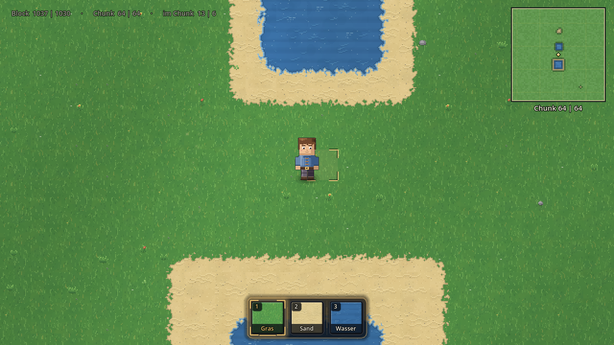
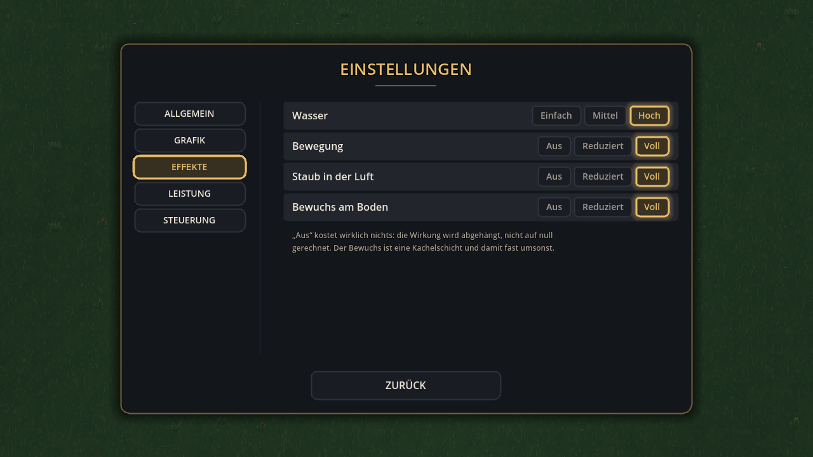

# 🌾 Talhain

Ein 2D-Top-Down-Sandkasten für Laptop und Desktop, gebaut mit **Godot 4.3**.
Du läufst als Wanderer über eine offene Karte und baust sie Block für Block
selbst — aus **Gras, Sand und Wasser**.


## So wird das Spiel gestartet

1. [Godot 4.3+](https://godotengine.org/download) herunterladen — eine einzelne
   ausführbare Datei, keine Installation nötig
2. Godot öffnen → **Importieren** → diesen Ordner wählen (die Datei `project.godot`)
3. **F5** drücken

Es startet die Szene `scenes/main.tscn`. Danach erscheint das Hauptmenü,
**SPIELEN** lädt die Welt (rund eine Viertelsekunde), und die Figur steht in der
Kartenmitte.

### Ohne Editor, direkt im Terminal

Zwei Befehle. Der erste ist **nur beim allerersten Mal** nötig — er legt den
Import-Cache an. Ohne ihn bricht Godot mit `Identifier "Config" not declared`
ab, weil die Skripte sich ohne Cache gegenseitig nicht finden.

```bash
cd <Ordner mit project.godot>
godot --headless --import      # einmalig, dauert ein paar Sekunden
godot                          # Spiel starten
```

Heißt die Godot-Datei bei dir anders (etwa `Godot_v4.3-stable_win64.exe` oder
`Godot.app`), nimm diesen Namen statt `godot`:

| System | erster Befehl (einmalig) | danach jedes Mal |
|---|---|---|
| **Windows** | `.\Godot_v4.3-stable_win64.exe --headless --import` | `.\Godot_v4.3-stable_win64.exe` |
| **macOS** | `/Applications/Godot.app/Contents/MacOS/Godot --headless --import` | `/Applications/Godot.app/Contents/MacOS/Godot` |
| **Linux** | `./Godot_v4.3-stable_linux.x86_64 --headless --import` | `./Godot_v4.3-stable_linux.x86_64` |

Beim Öffnen über die Godot-Oberfläche entfällt der Import-Befehl — das erledigt
der Editor selbst.

Alle Grafiken und die Musik entstehen beim Start im Spiel selbst — es müssen
keine Assets heruntergeladen oder importiert werden. Die Lizenzlage ist in
[`CREDITS.md`](CREDITS.md) dokumentiert.

## Drei Materialien — und sonst nichts

Es gibt genau drei Böden. Nicht neun, nicht sechs, drei:

| Material | Verhalten |
|---|---|
| **Gras** | fester Boden, Grundfüllung der ganzen Karte |
| **Sand** | fester Boden, weicher Übergang zum Gras |
| **Wasser** | wird durchschwommen: langsamer, kein Rennen, kein Springen |

Keines der drei hält auf. Die einzige unsichtbare Wand ist der Kartenrand.
Vorher gab es zusätzlich Wiese, Waldboden, Weg, Pflaster, Fels und Tiefwasser —
die sind vollständig entfernt, samt Kachelgrafik, Kollisionsdaten,
Höhenstufen-System und allen Verweisen darauf. Der Selbsttest durchsucht den
Quelltext danach und schlägt fehl, sobald noch einer auftaucht.

## Die Welt

Das Spiel startet mit einer **leeren Karte** — und ohne Raster. Das Raster ist
das technische Skelett der Welt und hilft beim Planen, aber es ist ein
Werkzeug, kein Teil der Welt: eingeschaltet legt es ein gelbes Kreuz über den
ganzen Bildschirm und schreibt „Chunk 64 | 64" quer neben die Figur. Wer das
Spiel zum ersten Mal startete, sah genau das — eine Karte mit Gitternetz, keinen
Ort. **G** schaltet es an, die Steuerungshilfe sagt das in der ersten Zeile, und
die Minimap zeigt Gebautes auch ohne Raster.

Eingeschaltet ist es bewusst zurückhaltend. Vorher waren die Blocklinien
kräftig rot und die Chunk-Linien kräftig gelb; über den ganzen Bildschirm
gelegt sah die Welt damit aus wie Millimeterpapier. Zum Planen reicht eine
Linie, die man sieht, wenn man sie sucht.

- **Ein Block = 32 × 32 Pixel.** Die Karte ist **2048 × 2048 Blöcke** groß —
  65 536 × 65 536 Pixel. Einmal quer durchzulaufen dauert rennend rund vier
  Minuten.
- **Ein Chunk = 16 × 16 Blöcke** (512 px), also **128 × 128 = 16 384 Chunks**.
  Die Chunk-Grenzen sind gelb und tragen ihre Nummer in der oberen linken Ecke.
- Geladen sind immer nur **5 × 5 Chunks um die Figur**; beim Laufen kommen neue
  dazu und alte fallen weg. Ohne das wäre die Karte nicht darstellbar.
- Oben links steht Chunk, Block und Position innerhalb des Chunks.
- Oben rechts eine **Minimap** mit vier Chunks Umgebung.
- **G** schaltet nur die **Rasterlinien** um. Die Bauvorschau unter dem Zeiger
  bleibt immer sichtbar — sie zeigt die gewählte Kachel halbdurchsichtig im
  Block, damit man sieht, *wohin* und *was* man setzt.
- **Bodenmarken liegen unter der Figur.** Bauvorschau und das markierte Feld
  werden auf einer eigenen Ebene unter der Spielfigur gezeichnet, Rasterlinien
  und Chunk-Nummern darüber. Vorher lag alles zusammen ganz oben — und weil das
  Zielfeld fast immer an die Figur grenzt, lag ein halbdurchsichtiger Schleier
  über ihrer unteren Hälfte und die weißen Eckwinkel liefen quer durchs
  Gesicht. Die Figur sah durchsichtig aus. Eine Markierung auf dem Boden gehört
  auf den Boden: sie darf von dem verdeckt werden, was darauf steht.


## Bauen

Unten steht die Bauleiste: drei Felder in einer zusammenhängenden Leiste, jedes
mit Nummer, Materialbild und Namen. Das Bild ist kein Ersatzsymbol, sondern ein
Stück echter Boden — vier der Kacheln, die auch auf der Karte liegen, in
ganzzahliger Vergrößerung und deshalb ohne Verzerrung. Das gewählte Feld hat
einen kräftigen Rahmen in der Akzentfarbe und einen weichen Schein, es ist also
auch aus dem Augenwinkel zu erkennen.

- **1 – 3**, **Mausrad** oder ein **Klick auf das Feld** wählt den Bodentyp.
- **Linke Maustaste** setzt ihn auf den Block unter dem Zeiger, **rechte
  Maustaste** setzt zurück auf Gras. Gedrückt halten malt.
- Der Block unter dem Zeiger wird von **vier Eckwinkeln** eingefasst, mit der
  gewählten Kachel halbdurchsichtig darin. Winkel statt eines geschlossenen
  Kastens: ein Kasten legt sich wie ein zweites Raster über die Welt und
  schluckt die Kachel darunter.
- Jeder gesetzte Block bekommt für zwei Zehntelsekunden einen **Rahmen, der
  herauswächst und verblasst** — ohne so ein Zeichen fühlt sich Bauen an, als
  füllte man eine Tabelle aus. Beim schnellen Ziehen bleiben höchstens 24
  Zeichen stehen, sonst verdecken sie die Welt, die sie zeigen sollen.
- Beim Aufkommen nach einem Sprung staubt es kurz unter der Figur.
- Ein gesetzter Block **füllt sein Feld** und verbindet sich mit den Nachbarn —
  eine Reihe wird ein Streifen, kein Punktmuster. Das gilt in alle acht
  Richtungen, für jede Materialkombination und auch beim schnellen Ziehen.
- Die Übergänge zu den Nachbarn werden sofort mitgerechnet.

### Das Gelände erkennt die Form

Die Übergangskachel eines Feldes ist durch ihre **Eckmaske** bestimmt: vier
Bits, eines je Ecke, gesetzt wenn eines der drei dort anliegenden Felder zur
Schicht gehört. Daraus ergibt sich von selbst, welche Darstellung passt:

| Was gebaut wurde | Was das Feld daneben bekommt |
|---|---|
| einzelnes Feld | Vollkachel; ringsum Kanten und Aussenecken |
| gerade Fläche | Vollkachel innen, gerade Kante aussen (2 Bits) |
| Aussenecke | nur diagonal berührt → 1 Bit |
| Innenecke (L-Form) | drei Ecken bedeckt → 3 Bits |
| Übergang zu Wasser | hart am Block, kein Saum — sonst läge die Brandung auf dem Sand |

Der Selbsttest baut jede dieser Formen und prüft die Maske, statt Bilder zu
vergleichen: „Feld schräg über einem Einzelblock ist eine Aussenecke",
„Das Feld in der Kerbe einer L-Form ist eine Innenecke". Ein Ausrutscher im
Autotiling fällt damit sofort auf.
- Gebaut werden kann auch **im Laufen und im Sprung**.


### Das Wasser zieht sich zurück

Wasser war die einzige Schicht mit einer harten Kante — und das sah man:
rechteckige Becken mit lineargezogenen Ufern. Weiche Übergänge wie bei Sand
gingen aber nicht, aus zwei Gründen: die Karte weiss, welches Feld Wasser ist,
und daran hängt das Schwimmen (die Figur liefe sichtbar auf Wasser, ohne zu
schwimmen); und Uferband und Brandung sassen am Blockrand.

Jetzt zieht sich das Wasser **innerhalb seines eigenen Feldes zurück**. Eine
Ecke gilt nur, wenn alle drei dort anliegenden Felder Wasser sind — sonst
frisst dieselbe Rauschkante wie überall sonst ein Stück davon weg. Darunter
liegt Sand, der dabei zum Vorschein kommt.



Ein einzelnes Wasserfeld wird dadurch eine **runde Pfütze** statt eines
Quadrats, und ein Becken bekommt geschwungene Ufer und weiche Ecken — ohne dass
Karte und Bild auseinanderlaufen.

Schaum und Tiefe stehen dabei **in der Wasserkachel selbst**: aussen ein heller
Schaumsaum, nach innen ein dunkleres Tiefenband. Vorher lagen sie in einer
zweiten Schicht am Blockrand, und das Ergebnis war eindeutig: um jeden Teich
lief ein schnurgerades dunkles Rechteck durch den Sand, während die Wasserlinie
daneben geschwungen verlief. Zwei Beschreibungen derselben Küste, die sich
widersprechen — und die falsche war die gerade. Die Kantenschicht ist deshalb
weg; es gibt nur noch eine Quelle.

Die Wasserfläche selbst hat vier Lagen: weiche Tiefenbänder, eine mittlere Lage,
die sie aufbricht, Glanzkanten mit Schatten darunter (erst der Schatten macht
daraus eine Welle) und sparsames Funkeln. Dazu ein einzelner heller Reflex je
Kachel, oben links — dort, wo in dieser Welt das Licht herkommt.

Gesetztes **Wasser lässt sich durchschwimmen** — die Figur sinkt ein, wird
langsamer und bekommt einen Wellenkragen. Unter der Wasserlinie wird sie nicht
abgeschnitten, sondern **eingetaucht**: durchscheinend und zur Wasserfarbe hin
verschoben, nach unten hin immer weniger. Vorher wurde alles darunter gelöscht,
und das sah aus, als steckte sie in einem gestanzten Loch. Der Wellenkragen ist
ein **Ring** statt dreier waagerechter Reihen — er läuft vorn über den Körper
und verschwindet hinten dahinter, und daran erkennt man, dass die Figur *im*
Wasser ist und nicht davor:


## Inventar

**E** öffnet das Inventar, **E** schliesst es wieder, **E** öffnet es erneut —
ein echter Umschalter. **ESC** schliesst ebenfalls.

Das Inventar ist ein eigener Spielzustand: solange es offen ist, **passiert in
der Welt nichts**. Keine Bewegung, kein Bauen, kein Abbauen, keine Bauvorschau,
keine Mausaktion. Ein Klick auf ein Feld im Inventar setzt niemals gleichzeitig
einen Block. Dasselbe gilt für Pause und Optionen — ein Klick auf „Fortsetzen“
setzt keinen Block mehr.

Oben stehen die drei Materialien, unten die Bauleiste — dieselbe Leiste, die im
Spiel unten am Bildrand steht, mit denselben Feldern. Ein Klick auf ein Feld
wählt es, ein Klick auf ein Material legt es darauf. Die Belegung bleibt
gespeichert.

Erklärt wird das nicht mehr mit einem Satz, sondern mit der Anzeige selbst: das
gewählte Feld **und** das Material, das darauf liegt, sind gleichzeitig
hervorgehoben. Jedes Feld hat vier klar unterscheidbare Zustände — ruhig, beim
Überfahren aufgehellt, gewählt mit Rahmen und Schein, und abgeblendet. Die
Übergänge dazwischen sind kurz und ruhig.

Inventar und Bauleiste bleiben getrennte Ansichten mit getrennten Aufgaben: das
Inventar bestückt, die Leiste wählt im Spiel schnell aus. Sie teilen sich genau
einen Zustand — das gewählte Feld — und werden nie gleichzeitig angezeigt.

Im Bild unten sieht man alle drei Zustände auf einmal: **Gras** gewählt,
**Sand** überfahren, **Wasser** ruhig.


### Die Bauleiste liegt über der Welt

Sie ist deshalb **durchscheinend** — Rahmen und Felder lassen den Boden
darunter durch. Nicht zu weit: unter der Leiste steht mal Gras, mal Sand, mal
Wasser, und die Materialnamen müssen auf jedem davon lesbar bleiben. Dieselbe
Klasse baut die Felder im Inventar, dort aber **undurchsichtig**: hinter dem
Inventar liegt ohnehin ein abgedunkelter Hintergrund, und ein durchscheinendes
Feld wäre da nur unruhig. Ein Schalter, zwei Aufträge — zwei Kopien derselben
Zeichnung wären die sichere Art, dass eine davon irgendwann anders aussieht.

Zwischen den Feldern stehen **Fugen**. Drei Felder mit Luft dazwischen lesen
sich als drei einzelne Schaltflächen, die zufällig nebeneinander liegen; eine
Linie in jeder Lücke macht daraus eine Leiste mit drei Fächern.

Die Auswahl ist **kein gelber Kasten** mehr. Vorher trug die Farbe die ganze
Aussage und die Form gar keine — über der Welt las sich das als aufgeklebtes
Rechteck. Jetzt sind es vier Eckwinkel, ein kurzer Fußstrich und der Schein,
den es schon gab; der Rahmen selbst bleibt zurückhaltend.

Und die Materialbilder sind **Brocken statt Farbproben**: dasselbe Stück
echten Bodens wie vorher, aber mit Lichtkante oben links, Schattenkante unten
rechts und abgerundeten Ecken. Ein 64 × 64 großes Stück Gras ohne Form ist ein
grünes Rechteck — technisch richtig, aber es sagt nichts.

## Menüs

Alle Oberflächen — Hauptmenü, Pause, Einstellungen, Rückfragen, Inventar und
Bauleiste — sind aus denselben Bausteinen gebaut: dieselben Abstände, dieselben
Radien, dieselbe Schriftstaffel, dieselben Farben, dieselbe Einblendung. Die
Werte stehen an genau einer Stelle (`src/ui/ui_theme.gd`); kein Menü erfindet
eigene. Der Selbsttest prüft, dass wirklich jede Oberfläche dasselbe Theme
benutzt — das ging vorher still schief, weil Godot ein Theme nicht über eine
`CanvasLayer` hinweg vererbt.

Jede Schaltfläche hat vier unterscheidbare Zustände (ruhig, überfahren,
gedrückt, Fokus) und wächst beim Überfahren einen Hauch, statt hart die Farbe
zu wechseln. Tastatur und Maus sehen dabei gleich aus: wer mit den Pfeiltasten
durch ein Menü geht, sieht dasselbe wie mit dem Zeiger.

**Hauptmenü** — **Fortsetzen** steht nur da, wenn es eine gebaute Karte gibt.


**Neue Welt** fragt vorher nach, wenn dabei eine gebaute Karte verloren ginge.
Die Datei wird dabei nicht gelöscht — sie wird erst beim nächsten Speichern
überschrieben:


**Pause** — ESC hält das Spiel an. Solange ein Menü offen ist, passiert in der
Welt nichts: keine Bewegung, kein Bauen, keine Mausaktion. Ein Menü bleibt
undurchlässig, bis es ganz ausgeblendet ist — der Klick auf „Fortsetzen" kann
deshalb keinen Block setzen.


## Einstellungen

Kategorien statt einer langen Liste: **Allgemein**, **Grafik**, **Effekte**,
**Leistung**, **Steuerung**. Jede Zeile ist ein Streifen über die ganze
Seitenbreite — Beschriftung links, Stufen rechts. Auch Schalter sind Stufen
(„Aus / An"), damit nicht Kästchen neben Auswahlfeldern stehen.

Kein „Ton": der bestand aus einem einzigen Regler und war eine fast leere
Seite. Ein Thema, das aus einer Zeile besteht, ist kein Thema, sondern
eine Zeile — die Musik steht jetzt bei „Allgemein", mit ihrem Wert in Prozent
daneben.


Fünf Kategorien: **Allgemein**, **Grafik**, **Effekte**, **Leistung**,
**Steuerung**. „Effekte" ist eine eigene Seite geworden, weil die Grafikseite
sonst eine Liste aus neun Zeilen wäre, durch die man sich hindurchliest.




Unter **Steuerung** steht die vollständige Tastenbelegung als Tabelle über die
volle Seitenbreite:


Es steht dort **nichts, was nicht wirkt**:

| Einstellung | Was sie tatsächlich tut |
|---|---|
| **Sichtweite** 3×3 … 9×9 | setzt den Chunk-Radius; mehr Chunks werden geladen und kommen über die nächsten Bilder dazu, zu weite fliegen sofort raus |
| **Wasser** Einfach / Mittel / Hoch | Bildrate der Wasserwirkung (8 / 16 / 24 Hz); „Einfach“ zeichnet Glitzern und Brandung gar nicht mehr |
| **Bewegung** Aus / Reduziert / Voll | Wind über dem Gras und Licht auf dem Wasser; „Aus“ hängt die Materialien ab, statt sie auf null zu rechnen |
| **Staub in der Luft** Aus / Reduziert / Voll | 0 / 18 / 42 schwebende Punkte im sichtbaren Ausschnitt |
| **Bewuchs am Boden** Aus / Reduziert / Voll | Dichte der Streu-Dekoration (Gras 0 / 70 / 150 ‰, Sand 0 / 25 / 55 ‰); „Aus“ lädt die Schicht gar nicht erst |
| **Beleuchtung** Aus / Fest / Tagesverlauf | Tageslicht, Schein um die Figur und Vignette; „Aus“ hängt alle drei ab und stellt den Prozessschritt ein |
| **Schatten** Aus / An | der Bodenschatten der Figur |
| **Bildratengrenze** 30 … Unbegrenzt | `Engine.max_fps` |
| **Bildsynchronisierung** | VSync des Fensters |
| **Vollbild**, **Hinweise**, **Leistungsanzeige**, **Musik** | wie gehabt |

Eine **Mindest-Bildrate** gibt es bewusst nicht: die kann kein Spiel zusichern.
Was eingestellt wird, ist eine Obergrenze — sie hält die Bildabstände
gleichmäßig, statt so viele Bilder wie möglich zu erzeugen.

Alles wird sofort wirksam und sofort in `user://settings.cfg` gesichert. Der
Selbsttest prüft für jede Einstellung, dass sich das System dahinter ändert,
und dass sie einen Neustart übersteht.

Unter **Steuerung** steht die vollständige Tastenbelegung — erzeugt aus der
tatsächlichen InputMap, sie kann also nicht veralten.

## Die Welt bewegt sich

Über dem Gras laufen **Windböen**, über dem Wasser wandern **Lichtstreifen**,
und in der Luft schweben **Staub und Pollen**. Zusammen ist das der Unterschied
zwischen einem Bild und „draußen“ — ohne sie steht die Luft über dem Boden
völlig still.

Wind und Wasserlicht laufen als Shader auf der jeweiligen Bodenschicht. Das ist
hier die einzige vertretbare Bauform: der Boden sind vier `TileMapLayer` mit
Millionen möglicher Kacheln, ein Knoten je bewegtem Halm wäre nicht bezahlbar.
So kostet die Bewegung genau drei Materialien — unabhängig davon, wie groß die
Welt ist.

Zwei Entscheidungen stecken darin:

- **Gerechnet wird je Eckpunkt, nicht je Bildpunkt.** Eine Kachel hat vier Ecken
  und 1024 Bildpunkte. Die erste Fassung rechnete die Wellen im Fragment und
  kostete 66 ms je Bild statt 14 — dieselbe Wirkung im Vertex-Schritt kostet
  wieder rund 14. Die Wellenlänge liegt bei mehreren hundert Bildpunkten, die
  Interpolation über eine 32er-Kachel sieht man nicht.
- **Verändert wird die Helligkeit, nicht die Lage der Bildpunkte.** Die Kacheln
  kommen aus einem Atlas; ein verschobenes UV griffe in die Nachbarkachel im
  Atlasbild, und an jeder Kachelkante entstünden Streifen fremder Farbe.

Der Staub lebt ausschließlich im sichtbaren Ausschnitt: wer ihn verlässt, wird
auf der Gegenseite wieder eingesetzt statt weiterberechnet. Dadurch kostet die
Wirkung immer gleich viel, egal wie groß die Welt ist.

Der Selbsttest misst alle vier Kombinationen (mit/ohne Wind, mit/ohne Staub) und
schlägt fehl, wenn die Bewegung das Bild um eine Größenordnung teurer macht.

### Der Boden sieht aus wie Boden

Die Gras- und Sandkacheln sind neu gezeichnet. Vorher lagen **230 deckende
Einzelpixel auf 1024** — knapp ein Viertel der Kachel. Aus zwei Metern Abstand
war das kein Gras, sondern Bildrauschen, und es überdeckte jede größere
Struktur. Jetzt sind es rund 70, und sie werden eingeblendet statt gesetzt.
Die Halme stehen in kleinen Büscheln statt gleichmäßig verstreut — zwei bis
drei nebeneinander liest man als Gras, einzelne Striche nicht.

Damit fielen auch die Helligkeitsstufen je Kachel auf, die das dichte Korn
vorher verdeckt hatte: sie sind von 3,5 % auf 1,8 % zurückgenommen. Die große
Helligkeitsbewegung kommt jetzt ohnehin vom Wind, und die läuft über
Kachelkanten hinweg weich durch.

### Das Wasser hat eine Tiefe

Eine Wasserfläche war bis zuletzt überall gleich hell — technisch richtig, aber
sie las sich als blaue Platte. Jetzt bestimmt die **Entfernung vom Ufer** die
Helligkeitsstufe der Kachel: Stufe 0 direkt am Ufer, Stufe 2 draußen. Außen
hell, in der Mitte dunkel — das ist der Unterschied zwischen einer Pfütze und
einem See.

Das nutzt die Stufen, die es schon gab, nur anders: bei Gras und Sand ist die
Stufe eine zufällige Schwankung aus Rauschen, und jeder sichtbare Unterschied
wäre ein Schachbrett (deshalb liegen sie dort nur 1,8 % auseinander). Beim
Wasser ist sie eine **Form**, sie folgt der Küstenlinie, und sie darf gesehen
werden — 8,5 %.

Die Tiefenstufe 2 wird bewusst nicht über den vollen 5 × 5-Umkreis geprüft
(24 Nachbarn je Wasserfeld wären beim Nachladen eines Chunks spürbar), sondern
nur über die vier Felder in zwei Schritten Abstand. Eine schmale diagonale
Bucht bekommt dadurch vielleicht eine Stufe zu viel. Auf dem Bildschirm sieht
man das nicht, im Ladebalken schon.

### Das Wasser glitzert nicht mehr im Takt

Der Wasser-Shader hatte **eine** Welle. Eine einzelne Welle läuft als
durchgehendes helles Band über die ganze Fläche: jeder Punkt auf derselben
Linie wird im selben Augenblick hell, und über einen See hinweg sieht man einen
Balken wandern. Wasser tut das nicht.

Jetzt sind es **zwei** mit ungleicher Richtung, Größe und Geschwindigkeit, und
sie werden **multipliziert** statt addiert: hell wird es nur, wo beide gerade
oben sind. Daraus werden einzelne Glanzstellen, die aufleuchten und vergehen.
Die Frequenzen stehen bewusst in keinem einfachen Verhältnis — das Muster
wiederholt sich erst nach sehr langer Zeit.

### Dekoration hat Seltenheiten

Vorher war jede Art gleich wahrscheinlich: auf einer Wiese lagen genauso viele
große Blumen wie Grasbüschel, und der Strand war zu einem Viertel mit Treibholz
bedeckt. Das liest sich nicht als Natur, sondern als gleichverteilte Streuung —
was es auch war.

Jetzt gibt es drei Stufen: **häufig** (Grasbüschel, Kiesel), **gelegentlich**
(Blumen, Klee, Steine, Muscheln), **selten** (weiße Blüte, Treibholz). Umgesetzt
über die Häufigkeit im Auswahlfeld — eine häufige Art steht zwölfmal darin, eine
seltene einmal. Das hält die Auswahl bei einem einzigen Streuwert je Feld, und
damit bleibt sie **deterministisch**: derselbe Seed ergibt dieselbe Wiese, auch
nach dem Nachladen eines Chunks.

### Der Schatten weicht dem Fackellicht aus

Am Tag kommt das Licht von oben links, und der Bodenschatten liegt fest unten
rechts — so ist er gezeichnet. Nachts ist die stärkste Lichtquelle im Bild aber
die Fackel in der Hand, und die steht seitlich neben der Figur. Ein Schatten,
der dann immer noch nach unten rechts fällt, während das Feuer rechts brennt,
widerspricht dem, was man sieht.

Er wird deshalb von der Flamme **weggeschoben**, umso weiter, je dunkler es
ist. Bei Tag steht er, wo er immer stand. Das ist kein echter Schattenwurf —
den gibt es nur auf der Stufe „Sehr hoch" — aber es erzählt dasselbe und kostet
nichts.

### Was groß ist, muss überall gleich sein

Gras und Sand haben seither **je zwei zusätzliche Farbtöne**: eine trockene
Stelle, die ins Gelbe zieht, und eine beschattete, die ins Blaue geht. Beim
Sand entsprechend eine sonnige und eine feuchte. Dazu Halme mit Neigung,
kleine Büschel, Kiesel, trockene Halme und winzige Blüten im Boden selbst.

Beim ersten Versuch steckte all das in den **Flecken** — den großen weichen
Farbwolken, die jede Kachelvariante für sich auswürfelt. Das war ein Fehler,
und er ist messbar:

```bash
godot --headless --path . -- --selftest   # „Nähte zwischen VERSCHIEDENEN Varianten"
```

Der Selbsttest legt jede Kachelvariante gegen jede andere derselben Stufe und
vergleicht den Farbsprung an der Stoßkante mit dem Sprung zwischen zwei
benachbarten Punkten im Kachelinneren. 1,0 heißt „so glatt wie innen".

| | vorher | erster Versuch | jetzt |
|---|---|---|---|
| Gras | 1,59 | 1,72 | **1,43** |
| Sand | 1,35 | 1,46 | **1,05** |
| Wasser | **1,94** | — | **1,11** |

Wasser war der schlechteste Wert im Projekt, und man sah es: die Tiefenbänder
liefen über die volle Kachelbreite und hörten an der Kante auf. Stieß dort eine
Kachel ohne Band an, sprang die Helligkeit — über eine ruhige Wasserfläche
hinweg als Gitter zu sehen. Sie stehen jetzt **in jeder Variante an derselben
Stelle**.

Daraus die Regel, die für jede Kachelgrafik mit Varianten gilt und die im Code
an drei Stellen steht: **was groß ist, muss in allen Varianten gleich sein,
sonst sieht man die Fuge. Was sich unterscheiden darf, muss klein oder weich
sein.** Die Farbe ist deshalb aus den Flecken in die **Halme und Körner**
gezogen — dort trägt sie dasselbe und kostet keine Naht.

Die alte Prüfung („ist eine Kachel mit SICH SELBST nahtlos?") gab es schon; sie
war nötig, aber sie hat nie die Frage gestellt, die auf dem Bildschirm gestellt
wird — dort liegt neben Variante 3 die Variante 7.

### Die Welt hat Dinge

Auf Gras und Sand liegt **Streu-Dekoration**: Grasbüschel, rote, gelbe und
weiße Blumen, Klee, Steine, Kiesel, Muscheln und Treibholz. Sie liegen in einer
**eigenen Kachelschicht** unter der Kantenschicht — nicht als einzelne Knoten.
Ein Knoten je Büschel wäre bei 5 × 5 geladenen Chunks sechsstellig; eine
Kachelschicht kostet dasselbe wie der Boden darunter, also fast nichts.

Wo etwas liegt, entscheidet der **ortsfeste Streuwert des Feldes**, nicht der
Zufall beim Laden: derselbe Fleck Wiese sieht nach dem Nachladen eines Chunks
wieder genauso aus. Auf Gras steht deutlich mehr als auf Sand — eine Wiese ist
bewachsen, ein Strand ist überwiegend leer, und ein gleichmäßig bestreuter
Strand sähe falsch aus.

## Drei Dinge, die wie Markierungen aussahen

Auf einem Bildschirmfoto standen helle Formen in der Welt, die dort niemand
hingesetzt hatte — kleine weiße Quadrate neben der Figur, weiße Kreuze auf der
Wiese und ein blass gestricheltes Rechteck um jeden Teich. Es war naheliegend,
sie für vergessene Entwicklermarken zu halten. Waren sie nicht. Es waren drei
verschiedene Sachen, und zwei davon waren echte Fehler.

**Das gestrichelte Rechteck war einer.** Die Wasserwirkung malte einen
animierten Schaumsaum an die Kachelkanten jeder Wasserzelle der **Karte**. Seit
sich die Wasser*zeichnung* um eine halbe Kachel zurückzieht, liegt diese Kante
nicht mehr am Wasser, sondern einen halben Block draußen im Sand — dieselbe
Sorte Fehler wie das dunkle Rechteck, das eine Runde vorher gelöscht wurde, nur
in Hellgrau. Es wäre möglich gewesen, den Saum auf die gezeichnete Linie zu
schieben; die verläuft aber verrauscht durch die Kachelmitte, und ein Saum
daneben stünde wieder als Linie da. Also gilt dieselbe Regel wie beim Ufer:
**eine Quelle.** Der Schaum ist gebacken, und was sich bewegt, bewegt sich
innerhalb der Wasserfläche. Auch das Glitzern liegt jetzt nur noch auf Feldern,
deren acht Nachbarn Wasser sind — sonst läge es auf dem Strand.

**Die weißen Kreuze waren Blumen.** Fünf Punkte im Kreuz, der hellste in der
Mitte, in reinem Weiß auf grünem Grund: der stärkste Kontrast im ganzen Bild,
sternförmig, mit leuchtendem Kern. Jetzt hat der Kopf eine zweite Reihe (aus
dem Kreuz wird eine Form mit Ober- und Unterseite), und der Kern ist nicht mehr
die hellste, sondern eine **andere** Farbe. Eine weiße Blüte mit gelbem Kern
liest man sofort als Blume; ein weißer Stern mit weißem Kern nicht.

**Die Quadrate neben der Figur waren die Bauvorschau.** Vier Eckwinkel in
reinem Weiß bei 95 % — ohne Farbe, die zum Spiel gehört, und ohne etwas, worauf
sie sich sichtbar bezogen: das gewählte Material war Gras, das Geistbild lag
auf Gras, also sah man nur die Winkel. Sie sind jetzt warm (dieselbe
Akzentfarbe wie die gewählte Kachel in der Leiste) und rahmen einen schwachen
Schleier ein, damit sie auf etwas zeigen.

**Und der Staub in der Luft** war zwar keine Markierung, aber fast reines Weiß
bei bis zu 62 % — heller als jede Grasspitze und heller als der Sand. Er ist
jetzt blasses Stroh bei höchstens 34 %. Die Grenze steht als Prüfung im
Selbsttest: *blasser als der hellste Boden, den es in dieser Welt gibt.* Wer
ihn ganz abschalten will, findet ihn unter **Einstellungen → Effekte → Staub**.

Auch die Figurenmarke auf der Minimap war ein weißes Quadrat mit schwarzem
Saum — dieselbe Form. Sie ist jetzt eine Raute in der Akzentfarbe.

## Die Minimap zeigt Formen

Die Übersichtskarte oben rechts war eine Ansammlung von Farbflächen: man sah,
*dass* dort Wasser ist, aber nicht, welche Form es hat. Jedes Feld an einer
Materialgrenze wird jetzt **dunkler gezeichnet** — vier Nachbarvergleiche je
Punkt, 4096 Punkte, sechsmal je Sekunde. Damit bekommt jeder Teich einen
Umriss und wird auf drei Bildpunkten je Block lesbar.

Dazu drei Helligkeitsstufen je Bodentyp mit knapp vier Prozent Abstand, damit
die Karte dieselbe Körnung hat wie die Hauptansicht, und ein deutlich
schwächeres Chunk-Gitter: im Spiel liegt eine Linie über 32 Bildpunkten Kachel,
hier über dreien.

## Licht und Tageszeit

Ein **Tag** von acht Minuten läuft durch, und die Welt läuft mit — Morgenrot,
heller Vormittag, Mittag, Abendgold, Dämmerung, blaue Nacht.


### Und eine Messung, die gar nichts gemessen hat

Die erste Fassung benutzte Godots eingebaute 2D-Beleuchtung: ein `PointLight2D`
um die Figur und eine Vignette als Vollbild-Shader. Gemessen wurde damals mit
`Performance.TIME_PROCESS` — und damit **gar nicht**: das ist die Zeit im
`_process`-Schritt der Hauptschleife, das Zeichnen läuft danach und steckt
nicht darin. Herausgekommen war, die Beleuchtung koste nichts.

Es gibt einen Messharness, der die Engine selbst fragt:

```bash
godot --path . -- --profile
```

Er benutzt `viewport_get_measured_render_time_cpu` und `…_gpu`, und damit sieht
man es sofort (Software-Rasterizer, 1280 × 720):

| Fall | CPU-Render | GPU-Render |
|---|---|---|
| Beleuchtung aus | 6,07 ms | 2,66 ms |
| nur Tönung | 6,06 ms | 2,75 ms |
| + Figurenlicht | **9,48 ms** | 2,57 ms |
| + Vignette | **11,58 ms** | **4,72 ms** |

Eine Verdopplung der Renderkosten (+91 % CPU, +77 % GPU) — bei Tag wie bei
Nacht. Zwei Ursachen: ein echtes `Light2D` zwingt den Canvas-Renderer in den
beleuchteten Pfad und lässt jedes Element im Umkreis ein zweites Mal einreihen,
und ein Vollbild-Fragment-Shader rechnet für 921 600 Bildpunkte je Bild.

### Was stattdessen passiert

- **`CanvasModulate`** färbt und dunkelt die Welt über den Tag. Gemessen
  **gratis** — ein Multiplizieren, unabhängig von der Zahl der Kacheln. Das ist
  der Teil, der die Stimmung macht, und der bleibt genau so.
- **Der Schein** um die Figur ist ein additives Sprite statt eines Lichts. Ein
  Viereck je Lichtquelle, keine zweiten Durchgänge über die Welt.
- **Die Sichtgrenze** am Bildrand ist eine einmal gebackene Verlaufstextur
  statt eines Shaders.

Der Unterschied zum echten Licht: ein `Light2D` multipliziert mit der Farbe des
Untergrunds, ein additiver Schein legt warmes Licht darüber. Für eine Fackel
ist das zweite ohnehin das richtige Bild.

Am Tag hängt die **ganze Nachtschicht ab** und kostet nichts. Vorher lag die
Vignette auch mittags über dem Bild — sichtbar war davon fast nichts, bezahlt
wurde sie voll.

### Die Nacht war grün

In der Farbtabelle stand seit jeher `[0.00, Color(0.26, 0.30, 0.50)] ## tiefe
Nacht, blau`. Auf dem Bildschirm war die Nacht trotzdem **dunkelgrün**.

Der Grund ist eine Zeile Rechnung: `CanvasModulate` **multipliziert**. Gras ist
(78, 138, 68) — darin steckt fast kein Blau, das sich verstärken ließe. Mal
(0,26 / 0,30 / 0,50) ergibt (20, 41, 34), und das ist dunkles Grün. Eine blaue
Tönung kann aus einer grünen Wiese keine blaue Nacht machen.

Blau muss also **dazukommen**, nicht durchmultipliziert werden. Das ist eine
einzelne halbdurchsichtige Fläche über der Welt — ein Viereck, kein Shader —,
und sie liegt bewusst **unter** den Scheinen: so fällt das warme Fackellicht in
eine kalte Umgebung, und der Kontrast, den eine Nachtszene braucht, entsteht
von selbst.

Gemessen (llvmpipe, 1280 × 720): **ein zusätzlicher Zeichenaufruf, +0,19 ms
Bildzeit.** Auf echter Hardware ist ein einzelnes überblendetes Vollbildviereck
noch billiger; auf einem Software-Rasterizer schlägt es als Füllrate voll durch,
und genau deshalb steht hier die Bildzeit und nicht die CPU-Renderzeit.

Die Fackel hat dazu einen **zweiten, kleinen Schein** bekommen. Ein einzelner
weicher Verlauf über 76 Pixel hellt auf, aber er beleuchtet niemanden; eine
Flamme hat einen Kern. Zwei übereinandergelegte Verläufe ergeben diese Kurve —
und weil additiv addiert heißt, war der erste Versuch (0,50 + 0,50) prompt
wieder der weiße Fleck, den es hier schon einmal gab. Die **Summe** ist jetzt
0,53, und der Selbsttest rechnet sie nach.


### Fünf Stufen, nicht ein Schalter

Weil die Mittel sehr unterschiedlich kosten, sind sie einzeln abstufbar. Alle
Zahlen als Bildzeit, gemessen mit `--profile` (llvmpipe, 1280 × 720):

| Stufe | Was dazukommt | Bildzeit | FPS |
|---|---|---|---|
| **Aus** | nichts, kein Prozessschritt | 16,57 ms | 60 |
| **Einfach** | die Tönung, also der ganze Tagesverlauf | 16,54 ms | 60 |
| **Mittel** | dazu Blaustunde und Fackelschein | 19,43 ms | 51 |
| **Hoch** | dazu die Sichtgrenze am Bildrand | 24,72 ms | 40 |
| **Sehr hoch** | echtes `PointLight2D` statt des Scheins | **41,52 ms** | **24** |

Wer auf einem schwachen Laptop spielt, verliert mit „Einfach" nicht die Nacht,
sondern nur die Flächen, die Füllrate kosten. Die **Tageszeit** ist eine eigene
Zeile: ein stehender Tag kostet genauso viel wie ein laufender, das ist eine
Frage des Spielgefühls.

### „Sehr hoch": echtes 2D-Licht, und was es kostet

Diese Stufe legt als einzige ein echtes `PointLight2D` an — an der Flamme, als
Kind der Fackel, also der Hand folgend. Sie bringt zwei Dinge, die ein additives
Viereck grundsätzlich nicht kann:

- Ein echtes Licht **multipliziert** mit dem Untergrund, statt Helligkeit
  daraufzulegen. Unbeleuchtete Stellen bleiben dadurch wirklich dunkel.
- Verdecker (`LightOccluder2D`) werfen **Schatten**. Jede gesetzte Fackel hat
  einen; läuft man um sie herum, dreht sich ihr Schatten mit.

Und sie kostet, gemessen: **+16,80 ms Bildzeit** gegenüber „Hoch" — mehr als
alle anderen Lichtmittel zusammen, und ein Absturz von 40 auf 24 Bilder. Genau
diese Sorte Einbruch war der Grund, warum das echte Licht in einer früheren
Runde entfernt wurde.

Deshalb ist sie eine **ausdrückliche Wahl**: nicht voreingestellt, von keinem
Qualitätsprofil vergeben, und die automatische Anpassung nimmt sie als
allererstes zurück, wenn es klemmt. Auf jeder anderen Stufe gilt weiterhin die
Zusage, dass in dieser Welt **kein einziges** `Light2D` steht — der Selbsttest
prüft, dass es beim Zurückschalten wirklich wegfällt und nicht nur auf Energie
null steht. Ein Licht mit Energie null rechnet trotzdem.

Was es NICHT bringt: mehr Schattenwerfer. Die Welt besteht aus Bodenkacheln;
gesetzte Fackeln sind bis auf Weiteres das Einzige darin, was einen Schatten
werfen kann. Bäume und Felsen wären die nächste Runde.

## Der Sprung ist eine Bewegung

Der Sprung war vorher **nur eine Verschiebung**: dasselbe Standbild, ein Stück
weiter oben. Das liest sich als Objekt, das jemand hochhebt. Jetzt gibt es drei
Stellungen — gehockt (Absprung *und* Landung), gestreckt (der Aufstieg, Beine
angezogen) und fallend (Beine auseinander) — und nach dem Aufkommen federt die
Figur ein Sechstel einer Sekunde nach.

Gezeichnet, nicht skaliert: eine Figur, die man auf 1,08 streckt, hat an dieser
Stelle ungleich breite Pixel, und genau das ist der Fehler, wegen dem der Zoom
ganzzahlig ist.

### Und die Kleidung hat Stoff

Der Rumpf bestand aus drei senkrechten Streifen — hell, mittel, dunkel. Das ist
**Beleuchtung**, keine Textur: es sagt, woher das Licht kommt, aber nichts
darüber, dass da Stoff hängt. Jetzt liegen zwei schwache Falten darin, ein Saum
über dem Gürtel, eine Lichtkante auf dem Gürtel und ein Schatten des Gürtels
auf der Tunika darüber — erst dadurch liegt er *auf* der Tunika, statt in ihr
zu stecken. Die Hosenbeine haben eine Kniefalte und die Stiefel eine Sohle: ein
Hosenbein aus einer einzigen Farbe ist ein Balken.

Die Schultern sind einen Bildpunkt breiter als die Taille. Ein Rechteck von
Hals bis Gürtel hat keine Haltung; ein einziger Punkt Ausladung macht daraus
eine Gestalt mit Schultern.

## Fackeln

**Nachts trägt die Figur eine Fackel in der Hand.** Sie erscheint, sobald es
wirklich dämmert (ab 22 % Dunkelheit), verschwindet im Wasser, und ihre Flamme
läuft über vier Bilder mit wechselnder Höhe, Breite und Helligkeit — eine
Flamme, die stillsteht, ist kein Feuer.

Sie hängt an derselben Dunkelheit wie die Beleuchtung, nicht an einer eigenen
Uhr: sonst hielte die Figur bei abgeschalteter Beleuchtung mitten am Tag eine
brennende Fackel.

**F** setzt eine Fackel auf das Feld unter dem Zeiger, **F** nimmt sie wieder
weg. Sie leuchtet warm, flackert leicht und wird mit der Karte gespeichert.

Gesetzte Fackeln flackern genauso, und ihr Schein reicht weiter als die
Handfackel (120 gegen 92 Pixel): eine gesetzte Fackel steht fest und leuchtet
einen Platz aus, die Figur trägt nur ein Licht mit sich. Bewegt wird dabei nur,
was gerade im Bild liegt.

### Sie wird wirklich gehalten

Die Fackel ist in der Reihenfolge aufgebaut, in der man sie sieht — und das ist
hier keine Formsache, sondern der ganze Unterschied zwischen „gehalten" und
„danebengelegt":

| | |
|---|---|
| 1. Handrücken | **hinter** dem Stiel — die Fläche, gegen die er gedrückt wird |
| 2. Stiel | darüber, läuft oben und unten aus der Faust heraus |
| 3. Finger | **vor** dem Stiel, drei Glieder mit Fugen dazwischen |
| 4. Daumen | an der Lichtseite |
| 5. Wicklung | Leder um den Kopf, mit Schnur |
| 6. Flamme | vor allem, und ohne schwarzen Umriss |

Nach Schritt 3 bleibt **eine Spalte des Stiels sichtbar** zwischen Fingern und
Handrücken. Genau daran liest man, dass die Hand darum greift: Haut davor, Holz
in der Mitte, Haut dahinter.

Und sie sitzt an der richtigen Stelle. Vorher stand die Fackelposition als
eigene Tabelle in `player.gd`, von Hand eingestellt — **zwei Bildpunkte neben
der Hand der Figur**, mit einem Streifen Haut dazwischen. Auf einem
Bildschirmfoto sah man die Faust *neben* der Hand. Jetzt steht die Handposition
genau einmal (`ActorArt.HAND_AT`, abgelesen aus der Figurenzeichnung), und die
Fackel setzt ihren Griff darauf. Der Selbsttest misst den Abstand: **0,00 px.**

Die Fackel folgt außerdem dem **Armschwung**. Beim Laufen hebt und senkt sich
die Hand um zwei Bildpunkte je Bild; die Fackel bekommt dieselben Werte, mit
denen das Figurenbild gezeichnet wurde. Ohne das hinge sie sichtbar hinterher.

### Die Flamme flackert unregelmäßig

**Acht Bilder** statt vier. Bei vier liest man den Takt — dieselbe Folge
mehrmals je Sekunde, und das Auge findet den Rhythmus. Feuer hat keinen.

Die Werte für Höhe, Breite und Neigung der Spitze sind deshalb bewusst
**ungeordnet**: eine Folge, die auf- und wieder absteigt, liest sich als
Pulsieren, als atmete die Flamme. Echtes Feuer zuckt mal zweimal kurz
hintereinander hoch und bleibt dann drei Bilder fast gleich. In zwei der acht
Bilder löst sich ein **Funke** über der Spitze.

Die Form ist kein Stapel Ellipsen mehr, sondern ein Tropfen mit leckender
Spitze: unten am Docht schmal, über der Wicklung am breitesten, nach oben
auslaufend — und die Spitze biegt sich, während der Fuß stehen bleibt. Vier
Farbbänder von außen nach innen: rot, orange, gelb, weiß-gelber Kern.

Handfackel **11 fps**, gesetzte Fackel **9 fps** — eine im Halter steht still,
eine in der Hand wird bewegt.


### Das Licht sitzt an der Flamme

Vorher hing es an einem festen Punkt 18 Bildpunkte über den Füßen — also in der
Mitte der Figur. Der Lichtkegel ging vom Bauch aus, während das Feuer daneben
in der Hand brannte.

Jetzt folgt die Quelle **derselben Rechnung wie das Bild**: wandert die Hand,
wandert das Licht. Der Selbsttest rechnet den Punkt über einen zweiten Weg
zurück — aus dem gesetzten Fackel-Sprite statt aus der Lichtquelle — und
vergleicht: **0,0 px Abstand.** Genau das ging vorher auseinander, ohne dass es
jemand gemerkt hätte.

Weil die Quelle seither *neben* der Figur sitzt statt in ihr, ist der Abfall
flacher geworden (`pow(t, 1.45)` statt `1.7`) und der Radius von 76 auf 92
Bildpunkten gewachsen. Sonst läge der halbe Körper im Auslauf. Farbe **#FFAF64**
— warmes Orange, nicht Gelb: Gelb über einer blauen Nacht ergibt Grün.

### Flackern ist ein Zufallsgang, keine Schwingung

Vorher waren es zwei Sinus mit ungleicher Frequenz. Das ist besser als einer,
aber es bleibt periodisch. Jetzt springt die Helligkeit alle **0,05 bis 0,19
Sekunden** auf einen neuen Wert (±16 %) und läuft schnell darauf zu — weder die
Höhe der Sprünge noch ihr Abstand wiederholt sich. Der Radius atmet halb so
stark mit; voll mitzupulsieren sähe aus, als würde die Fackel gezoomt.

### Glut

Über jeder Flamme steigen vier Funken auf, taumeln seitlich und verlöschen nach
gut einer Sekunde. Ein Funke ist **ein Bildpunkt** — zwei wären ein Klotz, und
an einem Feuer sieht man ohnehin nur den Lichtpunkt.

Ein einziger Knoten zeichnet die Funken **aller** Feuer. Das ist die Stelle, an
der die Information schon liegt: der Lichtverwalter kennt jede Quelle, ihre
Weltposition und — wichtiger — ob sie gerade im Bild ist. Ein eigener
Partikelknoten je Fackel müsste all das noch einmal wissen, und hundert
gesetzte Fackeln wären hundert Knoten.

Ob sie da sind, sieht man auf einem Bildschirmfoto bei einem Bildpunkt nicht
sicher — also wird gezählt, was gezeichnet wurde. „Partikel vorhanden" wäre
sonst eine Behauptung.

Gemessen kostet das Figurenlicht mitsamt Glut **+0,49 ms Bildzeit** und zwei
Zeichenaufrufe (llvmpipe, 1280 × 720).

Dass es Fackeln überhaupt geben kann, hängt an der Messung oben: ein einziges
echtes 2D-Licht kostete +3,43 ms CPU-Renderzeit. Zehn Fackeln wären damit nicht
bezahlbar gewesen. Ein additives Sprite kostet ein Viereck — und ausserhalb des
Bildes gar nichts, weil es dort erst gar nicht gezeichnet wird.

## Die Figur ist viermal so fein wie die Welt

Auf einem Bildschirmfoto sah die Figur zu grob aus — „die Pixel sind zu groß".
Der Befund stimmte, die vermutete Ursache nicht: die Kacheln sind seit jeher
32 × 32, nicht 16 × 16. Groß wirken die Pixel wegen des **Zooms**. Bei Zoom 2
ist ein Weltpixel zwei Bildschirmpunkte, und daran ändert eine feinere
Zeichnung nichts.

Mehr Dichte bei gleicher Bildschirmgröße heißt deshalb zwingend: **Zoom
halbieren.** Für die Welt wäre das ein Umbau jedes Maßes im Spiel — Tempo,
Sprunghöhe, Kollision, Kachelatlas. Für die **Figur** geht es ohne all das:

- gezeichnet wird sie mit **64 × 96** statt 32 × 48 Bildpunkten
- dargestellt wird sie mit **Faktor 0,5**
- ihre Größe in der Welt bleibt damit exakt dieselbe
- bei Zoom 2 fällt ein Kunstpixel auf genau **einen** Bildschirmpunkt

Vier mal so viele Bildpunkte auf derselben Fläche — und dadurch Platz für das,
was vorher nicht hineinpasste: eine Pupille mit Lichtpunkt, eine Braue mit
Richtung, Haarsträhnen statt eines Blocks, Nähte im Stoff, einzelne Finger,
Stiefel mit Sohle und Schnürung, eine Lederwicklung mit sichtbaren Schnurgängen.

Dasselbe gilt für **beide Fackeln**. Zwei Gegenstände im selben Bild mit
unterschiedlich großen Pixeln fallen sofort auf, und die Fackel steht direkt
neben der Figur.

### Der Preis: die weiteste Ansicht

Das geht nur auf, solange `0,5 × Zoom` ganzzahlig ist. Bei Zoom 3 wären es
anderthalb Bildschirmpunkte je Kunstpixel — die Kanten der Figur würden beim
Laufen flimmern, und man sähe es nur in Bewegung. Die Zoomstufen sind deshalb
**2 / 4 / 6** statt 1 / 2 / 3:

| | vorher | jetzt |
|---|---|---|
| Weit | 1× | — |
| Normal | 2× | **2×** |
| Nah | 3× | 4× |
| Sehr nah | — | 6× |

„Normal" ist heute, was früher „Normal" war. Die alte weiteste Ansicht gibt es
nicht mehr: mehr Bildpunkte auf derselben Fläche **und** mehr Fläche im Bild
schließen sich aus. Der Selbsttest rechnet für jede Stufe nach, dass ein
Kunstpixel auf ganze Bildschirmpunkte fällt.

## Zoom

Drei feste Stufen, umgeschaltet mit **+** und **−**.

Ganzzahlig, und das ist keine Bequemlichkeit: bei einem Zoom von 1,5 wird aus
einem Weltpixel mal ein, mal zwei Bildschirmpunkte, und jede Figurenkante ist
abwechselnd ein und zwei Punkte dick. Stufen wie „85 %" würden diesen Fehler
zurückholen — sichtbar, an jeder Kante. Ein stufenloses Zoomen gäbe es hier nur
um den Preis unsauberer Pixel.

## Qualitätsprofile

Drei Profile — **Niedrig**, **Mittel**, **Hoch** —, und sie stellen **nicht
alles nach unten**. Das wäre keine Anpassung, sondern Aufgeben. Gemessen kostet
die Tönung des Tageslichts nichts und der Bewuchs am Boden nichts; beides bleibt
deshalb auch auf der niedrigsten Stufe an. Weggenommen wird, was Füllrate
frisst.

Zeigt ein Regler nicht mehr auf ein Profil, steht dort **„Eigene"** — eine
gespeicherte „aktuelle Stufe" würde irgendwann „Hoch" behaupten, während drei
Regler längst von Hand verstellt sind.

Dazu eine **Automatik** (Leistung → Automatik). Fällt die Bildzeit vier
Sekunden lang unter rund 44 Bilder, nimmt sie **eine** teure Wirkung weg —
teuerste zuerst, nach der Messreihe oben. Ist wieder Luft, gibt sie eine
zurück, aber nie mehr, als eingestellt war. Immer nur eine je Schritt: mehrere
gleichzeitig wären ein sichtbarer Sprung, und hinterher wüsste niemand, was
geholfen hat.

Beim ersten Start wird ein Profil vorgeschlagen. Dabei eine ehrliche
Einschränkung: **im GL-Compatibility-Renderer meldet Godot die Bauart der
Grafikkarte gar nicht** — `get_video_adapter_type()` liefert „unbekannt", auch
auf einem Rechner mit eigener Karte. Sicher erkennen lässt sich am Namen nur
der eine Fall, der wirklich eine Stufe nach unten gehört: ein
Software-Rasterizer. Der Rest ist eine grobe Einordnung nach Kernen und
Arbeitsspeicher — ein Anfangswert, kein Urteil. Entschieden wird danach an der
gemessenen Bildzeit.

## Anzeigen

Die **Leistungsanzeige** (Grafikeinstellungen → Leistung) zeigt FPS, Speicher,
CPU- und GPU-Renderzeit und Zeichenaufrufe. Sie ist bei jedem Start aus und
zeigt nur, was die Engine wirklich misst — liefert sie einen Wert nicht, steht
dort „—“ statt einer erfundenen Zahl.

Oben links steht **eine** Zeile: Block, Chunk und Position im Chunk. Darunter
stand früher noch „32 px je Block · 2048 × 2048 Blöcke = 128 × 128 Chunks" —
Zahlen, die eine ganze Sitzung lang dieselben bleiben und die Engine
beschreiben statt den Ort, an dem die Figur steht. Wer sie sehen will, drückt
**F3**.

**F3** blendet davon getrennt die **Entwicklerinfo** ein — zwei Spalten: links,
was die Welt gerade ist, rechts, was sie kostet.

| links | rechts |
|---|---|
| Feld, Chunk, Position im Chunk | FPS, Mittelwert, **1 % low**, Bildzeit |
| Bodentyp, begehbar, schwimmbar | CPU- und GPU-Renderzeit, Zeichenaufrufe |
| Zustand und Tempo der Figur | Figuren, Staubpunkte, Baumarken, Lichtquellen |
| geladene Chunks, davon im Bild | Spielspeicher, freier Systemspeicher, Grafikspeicher |
| Kollisionsformen, Felder im Bild | Fenster, Ansicht, Bildmassstab, Kamerazoom |
| Ladezeit des letzten Chunks | |
| Uhrzeit und Dunkelheit | |

Es steht dort **nichts, was nicht wirklich gemessen wird**. Godot liefert keine
Prozessor- oder Grafikkartenauslastung in Prozent — also steht so etwas dort
auch nicht, obwohl es gut aussähe. Wo ein Treiber einen Zähler nicht füllt,
steht ein Strich statt einer Null: eine Null sieht aus wie ein Messwert.

Und die Anzeige kostet selbst fast nichts: der Text wird viermal je Sekunde
gebaut, nicht sechzigmal, und nur solange sie sichtbar ist.


## Speichern

Die gebaute Karte wird **beim Zurückgehen ins Hauptmenü und beim Beenden
automatisch gesichert**, mit **F5** auch von Hand. Sie liegt in
`user://karte.dat` (unter Linux `~/.local/share/godot/app_userdata/Talhain/`).
Ältere Stände mit neun Bodentypen werden beim Laden auf die drei heutigen
umgesetzt; passen Fassung oder Kartenmaße gar nicht, wird die Datei übergangen
statt zu stürzen.

## Steuerung — frei belegbar

`W` `A` `S` `D` ist **nicht die Steuerung**, sondern nur der
Auslieferungszustand. Die Spiellogik fragt nirgends eine Taste ab, sondern
immer eine Aktion (`Input.is_action_pressed("move_up")`). Welche Taste das
auslöst, entscheidet allein die Steuerungsseite — deshalb kann jede Aktion auf
jede Taste, ohne dass am Spiel eine Zeile geändert werden müsste. Der
Selbsttest prüft das: in Welt, Figur, Kamera und Kern darf kein einziger
`KEY_`-Code stehen.


Eine Aktion trägt **mehrere Eingaben** (bis zu drei). Genau so funktionieren
WASD und Pfeiltasten gleichzeitig: sie liegen auf denselben vier Aktionen.

- Eine Taste **anklicken** und die neue drücken.
- **Rechtsklick** nimmt eine Belegung weg. Die letzte bleibt stehen — eine
  Aktion ohne Eingabe wäre unerreichbar, und man sähe im Menü nicht, dass sie
  es ist.
- Eine Taste, die schon woanders liegt, wird **abgelehnt**, mit Angabe wo.
- **Standard wiederherstellen** holt die Auslieferung zurück.

Gespeichert werden **physische** Tastencodes: die Taste an der Stelle, an der
auf einer amerikanischen Tastatur `W` sitzt. Auf einer französischen Tastatur
liegt dort `Z`, und genau die läuft dann vorwärts — sonst müsste jeder mit
einer anders angeordneten Tastatur die Steuerung von Hand neu belegen.
Angezeigt wird trotzdem der Buchstabe, der wirklich auf der Taste steht.

### Standardbelegung

| Eingabe | Aktion |
|---|---|
| **W A S D** oder **Pfeiltasten** | Laufen |
| **Shift** | Rennen (nicht im Wasser) |
| **Leertaste** | Springen |
| **Linke Maustaste** | Block setzen |
| **Rechte Maustaste** | Block zurücksetzen |
| **F** | Fackel setzen / wegnehmen |
| **1 – 3** / **Mausrad** | Material wählen |
| **E** | Inventar öffnen / schliessen |
| **+** / **−** | Näher heran / weiter weg |
| **G** | Blockraster ein / aus (beim Start aus) |
| **M** | Minimap ein / aus |
| **H** | Anzeige oben links ein / aus |
| **F3** | Entwicklerinfo ein / aus |
| **F5** | Karte speichern |
| **Esc** | Pause-Menü öffnen / schliessen |

## Was drin ist

**Boden** — Ein echtes Kachelraster aus vier `TileMapLayer`: Gras füllt die
Karte, darüber Sand, darüber Wasser, darüber die Kantenschicht mit Uferband und
Tiefenband. Die Schichten blenden sich per Terrain-Autotiling ineinander;
Übergangskacheln entstehen aus bilinearer Eckinterpolation mit gedithertem
Schwellwert. Das `TileSet` wird prozedural erzeugt, hat benannte Terrains mit
Eck-Bits und lässt sich im Godot-Editor mit dem Terrain-Pinsel weitermalen.

**Nahtlose Kacheln** — Jede Kachelgrafik wird mit umlaufendem Rand gezeichnet:
was rechts hinausläuft, kommt links wieder herein. Dadurch passt jede Kachel an
jede andere derselben Sorte, in jeder Nachbarschaft. Der Selbsttest misst das:
er vergleicht den Farbunterschied an der Naht mit dem im Kachelinneren. Gras
liegt bei 1,16, Sand bei 0,66, Wasser bei 0,82 — Werte um 1,0 heißen „so glatt
wie das Kachelinnere“, vorher lag Wasser bei 2,88.

**Auflösung** — 32 × 32 Pixel je Kachel bei Kamerazoom 1,5. Das Fenster
skaliert ganzzahlig (`stretch/mode = viewport`, `scale_mode = integer`), die
Kamera rundet auf gerade Weltpixel — es gibt keine halben Bildpunkte.

**Spieler** — Eigene Figur mit Idle-, Lauf- und Schwimmanimation in drei
Blickrichtungen (die vierte wird gespiegelt), Beschleunigung und Reibung.

**Kamera** — Folgt weich, bleibt innerhalb der Weltgrenzen.

**Kollision** — Nur der Kartenrand blockiert. Die Kollisionsrechtecke werden je
Chunk per Greedy-Zerlegung zusammengefasst und überlappen sich um einen halben
Pixel, damit `move_and_slide()` an einer Chunk-Grenze nicht hängenbleibt.

**UI** — Hauptmenü, Pause-Menü und Optionen (Musik, Vollbild, Hinweise,
Leistungsanzeige) mit erzeugten Pixel-Art-Rahmen. Das Titelbild hat gestaffelte
Hügel mit Dunstschleiern, ziehende Wolken und einen Vordergrund aus Halmen.
Einstellungen werden gespeichert.

**Audio** — Menü- und Weltmusik werden rechnerisch erzeugt. **Klangeffekte gibt
es bewusst keine** — kein Bau-, Schritt-, Klick- oder Sprunggeräusch. Es gibt
keine Audiodateien im Projekt.


## Projektstruktur

```
project.godot              Godot-4-Projekt (Nearest-Filter, GL Compatibility)
scenes/main.tscn           Einstiegsszene — alles Weitere entsteht im Code

src/core/config.gd         Konstanten (Kachelgröße, Tempo, Zoom) + Tastenbelegung
src/core/palette.gd        Die eine Farbpalette für alle Grafiken
src/core/settings.gd       Autoload: Einstellungen — nur Daten und Persistenz
src/core/graphics.gd       Autoload: wendet Einstellungen an, regelt Qualität nach
src/core/perf.gd           Autoload: Bild- und Renderzeiten, 1 % low — eine Quelle
src/core/quality.gd        Grafikprofile und was der Rechner davon verträgt
src/core/keybinds.gd       Tastenbelegung: Standard, Änderungen, Konflikte
src/core/main.gd           Zustandsautomat MENÜ / SPIEL / PAUSE / OPTIONEN / INVENTAR / RÜCKFRAGE

src/gfx/pixel.gd           Zeichen-Werkzeuge auf Images, mit umlaufendem Kachelrand
src/gfx/tile_art.gd        Die drei Bodenkacheln in Varianten und Helligkeitsstufen
src/gfx/tile_icon.gd       Materialbild der Oberfläche aus echten Bodenkacheln
src/gfx/world_shaders.gd   Wind über dem Gras, Licht auf dem Wasser
src/gfx/terrain_atlas.gd   Übergangskacheln für das Eck-Autotiling
src/gfx/actor_art.gd       Spielerfigur (Idle, Laufzyklus, Schwimmen, Bodenschatten)
src/gfx/decor_art.gd       Streu-Dekoration: Büschel, Blumen, Kiesel, Treibholz

src/world/map_data.gd      Kartendaten: drei Bodentypen, Begehbarkeit, Speichern
src/world/ground_tileset.gd TileSet mit Terrains, bemalt die Schichten
src/world/world_builder.gd Karte, Kachelgrafik und Kachelsatz erzeugen
src/world/chunk_streamer.gd Lädt und entlädt Chunks um die Figur, baut die Kollision
src/world/build_tool.gd    Blöcke setzen und entfernen, Speichern
src/world/water_fx.gd      Glitzern und Uferschaum (nur im Sichtbereich)
src/world/ambient_fx.gd    Staub und Pollen in der Luft (nur im Sichtbereich)
src/world/build_fx.gd      Kurze Rückmeldung: gesetzter Block, Landung
src/world/light_manager.gd Tageslicht, Schein um die Figur, Sichtgrenze
src/world/torches.gd       Gesetzte Fackeln: Bild in der Welt, Licht darüber
src/world/grid_overlay.gd  Raster darüber, Bodenmarken darunter
src/world/world.gd         Setzt die Spielwelt zusammen

src/player/player.gd       Bewegung, Sprung, Schwimmen, Animation
src/camera/game_camera.gd  Weiches Folgen, Weltgrenzen, pixelgenaues Runden

src/ui/ui_theme.gd         Die Designsprache: Abstände, Farben, Schrift, Bausteine
src/ui/ui_screen.gd        Grundgerüst jedes Vollbild-Menüs (Tafel, Ein-/Ausblenden)
src/ui/ui_button.gd        Die eine Schaltfläche des Spiels
src/ui/ui_choice.gd        Auswahlreihe („Aus / An", „30 / 60 / …")
src/ui/ui_anim.gd          Eine Auf- und Abblendkurve für alle Menüs
src/ui/menu_art.gd         Titelbild des Hauptmenüs
src/ui/cloud_layer.gd      Ziehende Wolken im Hauptmenü
src/ui/main_menu.gd        Startmenü
src/ui/pause_menu.gd       Pause-Menü
src/ui/options_menu.gd     Einstellungen in vier Kategorien
src/ui/confirm_dialog.gd   Rückfrage vor dem Überschreiben einer Karte
src/ui/hud.gd              Blockanzeige, Steuerungshinweis, Minimap und Anzeigen
src/ui/item_slot.gd        Ein Feld — für Inventar UND Bauleiste, ein Aussehen
src/ui/build_bar.gd        Bauleiste mit drei Feldern
src/ui/inventory.gd        Inventar: Material auf ein Feld der Leiste legen
src/ui/minimap.gd          Übersichtskarte oben rechts
src/ui/perf_overlay.gd     Leistungsanzeige (nur gemessene Werte)
src/ui/debug_overlay.gd    Entwicklerinfo auf F3

src/audio/audio.gd         Autoload: prozedurale Musik (ohne Klangeffekte)
src/dev/profiler.gd        Misst, was das BILD kostet (--profile)
src/dev/self_test.gd       Automatischer Selbsttest

prototype_godsim/          Früherer God-Sim-Prototyp, unverändert archiviert
```

## Selbsttest

Das Spiel prüft sich auf Wunsch selbst — Start, Karte, Kachelsatz, Bewegung,
Bauen, Wasser, Kollision, Kamera, Eingabetrennung, Menüwechsel, Ton und
Speichern:

```bash
godot --headless --path . --import      # nur beim allerersten Mal nötig
godot --headless --path . -- --selftest
```

Der Exit-Code ist 0, wenn alles in Ordnung ist — aktuell **335 Prüfungen**.

Der Lauf startet dabei auf den **Auslieferungswerten**, nicht auf dem, was der
letzte Lauf hinterlassen hat. Vorher erbte er die `settings.cfg` — und ein
früherer Lauf hatte dort den Staub auf 0 stehen lassen, worauf die Prüfung „Mit
Staub rechnet er wieder" in jedem folgenden Lauf fehlschlug, ohne dass sich am
Code etwas geändert hätte. Ein Test, dessen Ergebnis vom letzten Test abhängt,
prüft nicht mehr den Code.
Darunter unter anderem:

- genau drei Bodentypen in Aufzählung, Kachelstapel, Leiste, Inventar und Minimap
- kein Verweis auf einen entfernten Bodentyp mehr im Quelltext
- Kachelgröße, Atlasbereiche, Kachelursprung, Schichttransformationen,
  Z-Reihenfolge und die Umrechnung Feld → Weltkoordinate
- Bauen in alle acht Richtungen, alle neun Materialpaare nebeneinander,
  Reihen, schnelles Ziehen, 40 Setzungen am Stück, Bauen in Bewegung
- ins Wasser aus allen vier Richtungen: kein Ruck, kein Bildversatz nach oben
- E öffnet, E schliesst, E öffnet wieder — und tut in der Pause nichts
- bei Pause, Optionen und Inventar: kein Block, keine Bewegung, keine Vorschau
- Inventar: gleich große Felder, gleichmäßige Abstände, unverzerrte Materialbilder
- Auswahl heißt kräftigerer Rahmen UND Schein, nicht nur eine dünne Linie
- Überfahren hebt ein Feld ab und lässt es wieder los
- höchstens drei kurze Texte im ganzen Inventar
- kein Feld nimmt den Tastaturfokus, jedes fängt seinen Mausklick selbst ab
- jede Oberfläche erbt dasselbe Theme, jede Tafel ist deckend, keine
  Schaltfläche wird auf Containerbreite gezogen, jede Einstellungsseite passt
  in ihre Fläche
- jede Einstellung ändert das System dahinter (Engine-Bildrate, geladene
  Chunks, gezeichnete Wasserwirkung, Schatten der Figur) und übersteht einen
  Neustart
- Bewegung „Aus“ hängt die Materialien wirklich ab, die Wellen laufen im
  Vertex-Schritt, und die Bewegung kostet keine Größenordnung
- Beleuchtung: der Tagesverlauf springt nirgends, der Schein sitzt auf
  Brusthöhe bei der Figur und blendet nachts auf, „Fest“ hält die Zeit an,
  „Aus“ hängt alles ab, und das Licht bleibt bei den Zeichenaufrufen bescheiden
- **kein einziges echtes `Light2D`** in der Welt — auch nicht mit Fackeln; das
  ist die Prüfung, die den gemessenen Aufschlag von +3,43 ms fernhält
- jede Lichtstufe schaltet genau ihren Teil zu, und die Tönung bleibt auf allen
- eine echte Lücke bleibt eine Lücke: `[S][S][ ][S][S]` und ein einzeln
  entfernter Block mitten in einer Fläche zeigen den Boden darunter
- Profile stellen nicht alles nach unten, die Automatik gibt nie mehr zurück,
  als eingestellt war, und die Hardwareerkennung liefert echte Werte
- die Entwicklerinfo nennt alles Gemessene — und nichts Erfundenes
- **keine feste Taste in der Spiellogik**, Umbelegen wirkt, Konflikte werden
  abgelehnt, die letzte Eingabe lässt sich nicht wegnehmen, und die eigene
  Belegung übersteht einen Neustart
- Fackeln setzen, wegnehmen und speichern; jede Zoomstufe ist ganzzahlig und
  die Grenzen halten
- durchs Wasser laufen zieht eine Spur, sie bleibt gedeckelt und läuft aus
- ein einzelnes Wasserfeld wird eine runde Pfütze, die Mitte einer Fläche bleibt
  voll, ihre Ecke zieht sich zurück, und die Kante trägt ihren Schaum selbst
- der Sprung hat drei verschiedene Stellungen je Richtung, und sie sind nicht
  das Standbild
- die Handfackel ist nachts da, am Mittag weg, ihre Flamme bewegt sich, und sie
  leuchtet kürzer als eine gesetzte Fackel
- **beide Anzeigen passen in ihren Rahmen und auf den Bildschirm** — genau das
  war kaputt
- die Figur: drei verschiedene Stellungen je Laufrichtung, der Körper bleibt
  unter Wasser zu ahnen, der Wellenkragen ist ein Ring und kein Brett, der
  Bodenschatten fällt nach unten rechts
- Bodenmarken liegen unter der Figur, Rasterlinien darüber — und das Raster ist
  beim Start aus
- Einzelfeld, gerade Kante, Außenecke, Innenecke und der Übergang zu Wasser
  bekommen jeweils die richtige Eckmaske
- jeder gesetzte Block bekommt ein Zeichen, es verschwindet wieder, und beim
  Ziehen bleiben nie mehr als 24 stehen
- nichts rechnet, wenn es nichts zu rechnen gibt: Bau-Rückmeldung, Staub und
  Wasserwirkung schalten ihr `_process` wirklich ab
- mit gespeicherter Karte steht „Fortsetzen“ im Hauptmenü, und „Neue Welt“
  fragt vorher nach
- Musik vorhanden, Klangeffekte weder im Ton noch an einer Aufrufstelle
- keine fremde Asset-Datei im Projekt (siehe [`CREDITS.md`](CREDITS.md))

Weltaufbau rund 320 ms bei 2048 × 2048 Blöcken. Ein Chunk ist in 1,6 ms gemalt,
die Physik braucht 0,7 ms je Schritt. Die Bildzeit im Test stammt von einem
**Software-Rasterizer** ohne Grafikkarte und sagt nichts über einen echten
Rechner — sie schwankt dort zwischen zwei Läufen um mehr als das Doppelte (20
bis 55 ms) und ist als Vergleichswert gedacht, nicht als Versprechen. Genau
deshalb wird die Physikzeit auf **einen Schritt** umgerechnet statt auf ein
Bild: Godot holt die feste Schrittrate nach, und ungeteilt misst die Zahl die
Auslastung der Maschine statt der Physik.

Mit einer echten Anzeige lassen sich zusätzlich Screenshots ablegen:

```bash
godot --path . -- --selftest --shots=/tmp/shots
```

## Nächste Schritte

Die Architektur ist auf Erweiterung ausgelegt, aber bewusst schlank. Naheliegend
wären weitere Materialien (dann aber einzeln und geprüft), Figurenskins,
mehrere Speicherstände und Wetter.

Was es bewusst **noch nicht** gibt, damit hier nichts versprochen wird, das
nicht da ist: NPCs, Gegner, aufsammelbare Gegenstände, Fische, Feuer und Rauch,
Wettereffekte und eine Parallaxe im Hintergrund — das Spiel ist von oben
gesehen und hat keine Hintergrundebene, in der eine Parallaxe stattfinden
könnte.

---

*Der frühere God-Sim-Prototyp „Terraria Mundi“ liegt unverändert in
`prototype_godsim/` und ist über die Git-Historie jederzeit wieder erreichbar.*
